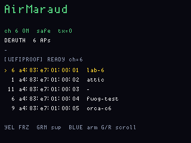
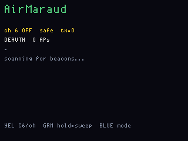
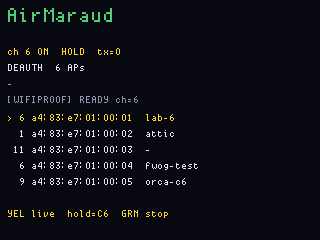
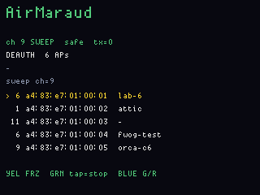
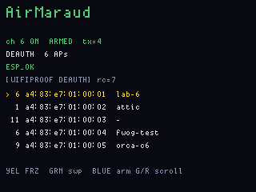
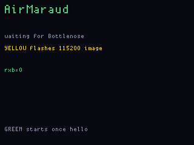
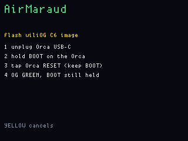
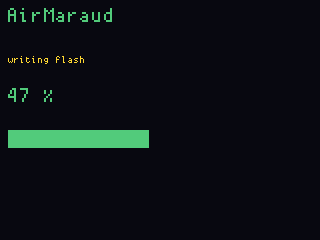
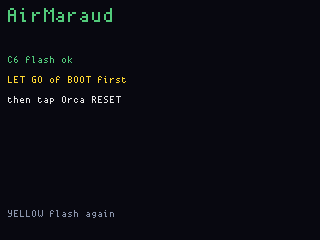

# AirMaraud

**Status:** firmware in `apps/airmaraud/` (VERSION **010**). Last: 2026-09-21.
**Fit:** add-on (Bottlenose ESP32-C6). Assessment-class — not a consumer toy.

Host chrome: `fw emu airmaraud --gui`. `am_status` injects a synthetic
scan list; it is not the C6.

A 2.4 GHz **lab** on the OG plus Bottlenose: see which access points are
on a channel, pick one, and fire **one** 802.11 deauthentication or
disassociation management frame at that BSSID. The OG is the operator
panel; the ESP32-C6 is the radio. It is not a background deauther, not
a Flipper Marauder port, and not a tool for networks you do not have in
writing. Keep-test: [retired.md](retired.md).

003 is the operator-chrome rev: full IDF `ret` on its own LCD line,
yellow **freeze** while scanning, louder ship clip. **004** puts BSSID
then SSID on each AP row and restores the footer (`BLUE arm`, `G/R up/dn`).
SSID needs a Bottlenose image built from this tree’s `wifiproof.c`
(`ssid=` on beacon/probe RX); an older C6 still lists MACs only.
**005** puts C6 flash back on **Yellow hold** (tap freeze / tap channel),
same as PingHalo. **006** restores the ON footer (`BLUE arm G/R scroll`)
and adds **Green hold** = hop channels 1–14, collecting APs (up to 8)
with the channel stored per BSSID so BLUE hops back before TX. **007**
runs the sweep off its own 1–14 counter (a missed `READY` used to freeze
the LCD on whatever channel it last heard — often 5), hops with
`WIFIPROOF ON N` so older C6 images still move, and keeps **24** APs
(G/R scrolls the five rows). **008** dwells **2 s** per sweep channel
(READY wait up to 2.5 s), lists probe responses even when dst is not
broadcast, and stops TXCOUNT from overwriting the gray RX line. **009**
puts **YEL FRZ** on the ON footer (Yellow hold is still C6 flash), restores
the pre-sweep sscanf RX parse, rate-limits the 24-AP status frame so the
C6 UART is not starved, and **needs a C6 reflash**: Bottlenose now prints
only beacon/probe-response lines (8 and 5). Auth/action used to flood
115200 and the OG dropped the beacons. Yellow-hold flash the Orca from
this UF2.
**010** prints SSID to the right of each MAC on ON (not only sweep): the
C6 RX line is now `src=` then `ssid=` and one print per BSSID so `ssid=`
is not clipped off 115200. Sweep dwells **30 s** per channel (a missed
READY used to hop at 2.5 s). Yellow-hold flash the Orca from this UF2.

## Silicon honesty

ESP-IDF `esp_wifi_80211_tx()` on ESP32-C6 documents beacon / probe /
action / non-QoS data. Deauth (mgmt subtype 12) and disassoc (subtype 10)
are **not** on that list. The API returning `ESP_OK` is not evidence the
PHY radiated the frame (IDFGH-14358 /
[esp-idf#15147](https://github.com/espressif/esp-idf/issues/15147)).

This binary still **sends** `WIFIPROOF DEAUTH|DASSOC` and shows
`last_ret` / `tx_count` from the C6. Treat `ESP_OK` as “IDF accepted the
buffer,” not “a sniffer saw a deauth” and not “a client dropped.” Until a
capture confirms radiation on this C6, do not demo it as a working
deauther. The scan list (beacons / probe responses) is ordinary C6 RX
and **is** the honest remainder; the TX path is the experiment.

Stock OG has no 2.4 GHz radio. Without Bottlenose the LCD stays on
“waiting for Bottlenose.”

## What a successful DEAUTH / DASSOC reports

BLUE (radio ON, a target selected) sends one frame, reason code **7**,
broadcast destination, AP BSSID as source and BSSID:

```
WIFIPROOF DEAUTH ff:ff:ff:ff:ff:ff <bssid> <bssid> 7
```

or `DASSOC` in place of `DEAUTH`. That is success **as this firmware can
see it** — IDF took the buffer. It is not a sniffer capture and not a
client leaving the BSS.

**C6 UART** (main CDC `DIAG` echoes the same lines) concatenates the
label and the TX result on one line, then AirMaraud polls the counter:

```
[WIFIPROOF DEAUTH] rc=7 [WIFIPROOF TX] ret=ESP_OK frame=<26-byte hex>
[WIFIPROOF TXCOUNT] count=<n> last_ret=ESP_OK
```

`DASSOC` prints `[WIFIPROOF DASSOC] rc=7` with the same `[WIFIPROOF TX]`
tail. `frame=` is 52 hex digits (26-byte mgmt header). `count` is how
many times the C6 called `esp_wifi_80211_tx` this session (it increments
before the call, so a later `ESP_ERR_*` still raises the count).

**LCD** (the TX line updates `ret` immediately; TXCOUNT refreshes `tx=`
within about 800 ms):

| Field | After a good fire |
|---|---|
| Status | `chN ON  ARMED  tx=<n>` with `<n>` one higher than before |
| Mode line | `DEAUTH` or `DASSOC` and AP count only |
| Ret line | full `ESP_OK` (green) — no `ret=` prefix, own row under the mode |
| Log | starts `[WIFIPROOF DEAUTH] rc=7` or `[WIFIPROOF DASSOC] rc=7` |
| WS2812 | red while `ARMED` |

Anything else is not this success: `ret=-` still, `tx=` unchanged,
`[WIFIPROOF] not armed`, `bad mac`, or `esp_err_to_name` other than
`ESP_OK` (`ESP_ERR_WIFI_IF`, `ESP_ERR_INVALID_STATE`, …).

## `ESP_ERR_INVALID_STATE`

The ret line now holds the full `esp_err_to_name` string (32 chars).
`ESP_ERR_INVALID_STATE` fits.

In this tree the C6 **only** returns that code itself when
`WIFIPROOF DEAUTH|DASSOC` arrives and the radio flag `s_on` is false —
it prints `[WIFIPROOF] not armed (WIFIPROOF ON first)` then
`ret=ESP_ERR_INVALID_STATE`. That is “ON never stuck, or the C6 dropped
out of ON,” not “the frame was the wrong length.”

`esp_wifi_80211_tx()`’s public header does **not** list
`ESP_ERR_INVALID_STATE` (`ESP_OK` / `ESP_ERR_WIFI_IF` /
`ESP_ERR_INVALID_ARG` / `ESP_ERR_WIFI_NO_MEM`). If the closed C6 driver
ever returns STATE, IDF’s precondition is the same idea: Wi-Fi not
started and promiscuous not on. WIFIPROOF ON is supposed to do both
before READY.

It is **not** caused by sending one frame instead of a burst. Mash BLUE
all you like while the C6 is off and you still get STATE. Fix: GREEN
until `READY ch=N` / LCD `ON`, then BLUE.

## One frame vs a pulse

BLUE is **one** 26-byte mgmt frame per press. That is the product:
gated, one-shot, not a Spacehuhn spray.

A single deauth/disassoc is a notification. Stations that honour it
reassociate in milliseconds; many ignore broadcast deauth. Tools that
“knock people off” send a **pulse** (tens to hundreds of frames, often
directed at both the AP and each STA). This firmware will not do that.
If `ret=ESP_OK` and nothing on the air changes, that is expected for one
shot — and still unproven on this C6 PHY even if you did spray.

## Gray line (under DEAUTH / DASSOC)

That dim line is **not** a mode. Modes are only `DEAUTH` and `DASSOC`
on the line above (BLUE while the radio is OFF toggles them). The gray
row is `s_st.log`: last WIFIPROOF UART line, or an OG-side hint, in a
40-character slot. While the radio is ON it is overwritten about every
800 ms by TXCOUNT, and whenever a beacon/probe RX lands, so it
flickers. **Yellow tap freeze is only while GREEN has the radio ON.**
It freezes the whole scan panel (status shows `HOLD`, hint `YEL live`);
yellow again thaws. Idle (radio off) yellow tap cycles channel instead.
GREEN stop also thaws.

| Gray text (as you’ll see it, maybe clipped) | Meaning |
|---|---|
| `scanning for beacons...` | Hello is up, nothing logged yet |
| `start first (GREEN)` | BLUE while LCD still `OFF` — no UART command sent |
| `no target` | BLUE with an empty AP list |
| `sweep ch=N` | Green-hold sweep is on channel N (1–14) |
| `sweep done` | Landed on ch 14, radio still ON, list kept |
| `hop to AP ch` | BLUE: radio was on a different channel than the cursor AP |
| `[WIFIPROOF] READY ch=N` | GREEN worked; radio on channel N |
| `[WIFIPROOF] off` | GREEN stop, or already off |
| `[WIFIPROOF] not armed (WIFIPROOF ON first)` | C6 got DEAUTH/DASSOC with `s_on` false → `ret=ESP_ERR_INVALID_STATE` |
| `[WIFIPROOF DEAUTH] rc=7 [WIFIPROOF TX]` | One deauth submitted (reason 7). Full `ESP_*` is the line above |
| `[WIFIPROOF DASSOC] rc=7 [WIFIPROOF TX]` | Same for disassoc |
| `[WIFIPROOF TXCOUNT] count=…` | Periodic poll; `last_ret` copied into `ret=` |
| `[WIFIPROOF RX] subtype=…` | After the **010** C6 image: only **8** (beacon) and **5** (probe response), one line per BSSID (`src=` then `ssid=`). Those populate the AP list; SSID is the field to the right of the MAC. Older C6 images also print **11** auth, **13** action, and a long `dst=`/`fc=` tail that clipped `ssid=` off 115200 — MACs listed, names did not. Freeze with yellow to read. |
| `[WIFIPROOF] bad channel` | ON with ch not 1–14 |
| `[WIFIPROOF] wifi start …` / `set channel …` / `promisc …` | IDF failed during ON; no READY |
| `[WIFIPROOF] bad mac` | Malformed address in the DEAUTH/DASSOC command |
| `[WIFIPROOF] unknown subcommand` | C6 image does not speak this WIFIPROOF dialect — flash the embedded wiliOG C6 |

BEACON usage/bad ssid/bssid exist on the C6 console; AirMaraud never
sends `WIFIPROOF BEACON`.

## Buttons

| Input | Idle (radio off) | WIFIPROOF on | C6 flash screens |
|---|---|---|---|
| Green tap | Start WIFIPROOF on current channel | Stop (also thaws a frozen scan). During sweep: stop hopping, stay ON | HOLD: write the image |
| Green hold | **Sweep 1–14**, collect APs | Same (starts a sweep from ch 1) | — |
| Yellow tap | Cycle channel 1–14 | **Freeze** / thaw | HOLD/FAIL/OK: cancel or retry |
| Yellow hold | **Arm C6 flash** | **Arm C6 flash** (stops radio) | — |
| Blue | DEAUTH ↔ DASSOC | Fire **one** armed frame at the cursor | — |
| Gray / Red tap | Cursor up / down | Cursor up / down (ignored while frozen) | — |
| Red hold 6 s | Power off (splash + louder ship clip) | same | same |

GREEN tap does not TX. GREEN hold surveys. BLUE fires one frame after
GREEN has started the radio (or after a sweep) and a target is on the
list. BLUE hops the C6 onto that AP’s stored channel first if needed.
The list holds 24 BSSIDs; the LCD shows five at a time (G/R).

## Screens

ogemu chrome (`fw emu airmaraud --gui`, or the headless
`tools/ogemu/scripts/airmaraud_shots.jsonl`). Canned APs, no C6, no RF.
The 6×8 font is the same as the board.

**Main scan** (GREEN on, SSIDs to the right of each MAC):



Idle after hello, yellow freeze, and a channel sweep:

| Hello, radio off | Freeze (yellow tap while ON) | Sweep (green hold) |
|---|---|---|
|  |  |  |

After BLUE (IDF accepted the buffer) and the wait screen with no hello:

| ARMED, `ESP_OK` | Waiting for Bottlenose |
|---|---|
|  |  |

Yellow-hold C6 flash:

| Hold BOOT | Writing | OK |
|---|---|---|
|  |  |  |

## How to test that it is doing what it claims

Layers. Do not skip to “the laptop dropped Wi-Fi.”

1. **Hello.** After splash, not `waiting for Bottlenose`. If it stays
   there, the C6 is not speaking `BN HELLO` — Yellow-hold flash the
   embedded wiliOG image (radio **off**), then Orca RESET. Main CDC
   `DIAG` should show `BN HELLO`.
2. **Scan.** GREEN tap → LCD `ON`, gray `[WIFIPROOF] READY ch=N`, then RX
   lines and AP rows. Owned AP on that channel must appear. Yellow
   freeze (only while ON): list and log stop moving; `HOLD` on the
   status line; yellow again they move. Radio off, yellow tap is
   channel, not freeze. **Green hold** (~700 ms): status `SWEEP`, hop
   1→14 (**30 s** dwell after READY, or after 2.5 s if READY never
   arrives — do not skip the channel), APs accumulate (channel left of
   BSSID, SSID right of MAC, max 24).
   `sweep done` leaves the radio ON at 14. Footer while ON:
   `BLUE arm G/R scroll`.
3. **Gating (no RF).** BLUE while `OFF` → `start first (GREEN)`. BLUE
   with empty list → `no target`.
4. **IDF TX (firmware success).** Channel on an **in-scope** AP, GREEN,
   cursor on it, BLUE. Ret line becomes full `ESP_OK` (or the full
   `ESP_ERR_*` name). `tx=` increments. DIAG:
   `[WIFIPROOF DEAUTH] rc=7 [WIFIPROOF TX] ret=ESP_OK frame=…`
   That is “IDF took the buffer.”
5. **Air (optional, scoped).** Sniffer on the same channel must see a
   26-byte deauth (subtype 12) or disassoc (10) to broadcast from that
   BSSID. Until that capture exists, do not call the C6 PHY proven.
   One BLUE is one frame; a client leaving is **not** the pass.

Ship clip: 6 s red hold. The board **powers off**. USB attach or gray
on `/QON` wakes it. 003 peak-normalizes the wav and plays it at asset
gain 5 (8-bit I2S expand is quiet at 1.0).

## C6 flash (Yellow hold)

The main UF2 embeds the Bottlenose image (`fwog_embed_c6_image`). Yellow
hold walks the operator through BOOT/RESET on the Orca, then GREEN writes.
Unplug the Orca USB-C first. After OK: let go of BOOT, tap Orca RESET.

## Chrome (every display app from 002)

Boot splash is the NES-box art with the DEF CON smiley-and-crossbones
seal bottom-right (`tools/gen_splash_art.py`, `art/defcon_seal.png`).
6 s red hold draws GOODBYE and plays
`bsp/display_cpu/lcd/art/bad_feeling_8k.wav` (8 kHz mono, peak-normalized, I2S gain 5) on
the MAX98357A before the pack FET opens.

## Bench (2026-09-20)

`fw build airmaraud_main && fw flash airmaraud_main` — main UF2 onto COM5.
Splash DEF CON seal: operator-verified on this board (not a camera still).

After splash the LCD is the idle WIFIPROOF panel: title **AirMaraud**,
**waiting for Bottlenose**, G/Y/B hints. The Orca is on the 20-pin header
with antennas; UART hello is not up, so the C6 is not running this
WIFIPROOF console yet. Yellow-hold C6 flash was **not** run. Ship clip
(6 s red) was **not** run — it opens the pack FET.

## Related

- [LanFerry](lanferry.md) — C6 SoftAP file-drop; not a rogue AP
- [PingHalo](pinghalo.md) — C6 BLE scan
- [console.md](console.md) — USB CDC; 1200 baud is BOOTSEL
- [retired.md](retired.md) — keep-test
- [flipper.md](flipper.md) — Marauder-class row
