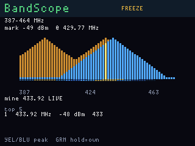

# BandScope

**Status:** firmware in `apps/bandscope/` (VERSION **004**). Last: 2026-09-21.

v004 lets you park on a bump: freeze, then yellow/blue jump between local
peaks, then green hold marks that frequency. v003 kept peak-hold and the
top-5 table across bands, added the history strip, and owned-gadget marks.
Flash `bandscope_main` (it carries the display image).

Sweep radio 0 across 300–348 / 387–464 / 779–928 MHz and plot RSSI vs
frequency on the ST7789. This is the OG's actual "SDR": no I/Q waterfall,
but a usable ISM reconnaissance screen. It does not demodulate or
transmit; parked decode and replay live in ISMburst / FobReplay / TireEar.

## Screens

ogemu panel (not hardware):

Static chrome: title, band, peak readout, frequency axis, button legend.
Live bars are cyan; an amber peak-hold overlay keeps the max height seen
in each bin (per band) until you clear it. The gold bar is the mark
cursor — it follows the live peak while sweeping, and stays put once you
freeze. A 16-row strip under the plot is recent sweeps of the **current**
band, newest at the top. Below that, **own** is up to four marked peaks
with LIVE/---, then **top 5** (freq + dBm + band).

## Buttons

| Button | Action |
|---|---|
| **Yellow / Blue** | Sweeping: previous / next band. **Frozen:** previous / next local peak (hold to crawl). Hold overlay and top-5 stay |
| **Green tap** | Freeze / unfreeze. Freeze keeps the last sweep and parks the cursor on the current peak |
| **Green hold 700 ms** | Toggle-mark the **cursor** as owned (`mine` / `lab` / `fob` / `wx`). Presence is LIVE when that bin is hot on the band being swept |
| **Gray** | Hunt: cycle all three CC1101 bands and accumulate the loudest bins. Gray again returns to a live sweep |
| **Red tap** | Clear peak-hold, history strip, owned marks, and the top-5 table |
| **Red hold 6 s** | Ship / power off (`fwog_power_poll`) |

To mark a bump that is not the loudest: sweep until you see it, green tap
to freeze, yellow/blue until the gold bar sits on it, green hold.

Hunt walks 300–348, 387–464, then 779–928, then repeats, updating the
top-5 list as it goes. Antennas follow the band being measured.

v002 stopped the LCD from strobing: chrome stays put, spectrum bars are
patched in place. v001 wiped the whole spectrum on every paint (and
painted every 2 ms), which is what the panel showed as a continuous flash.
