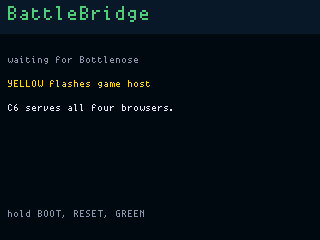
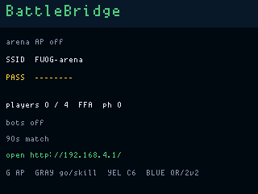
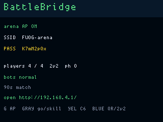
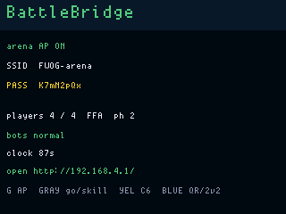
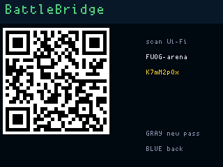
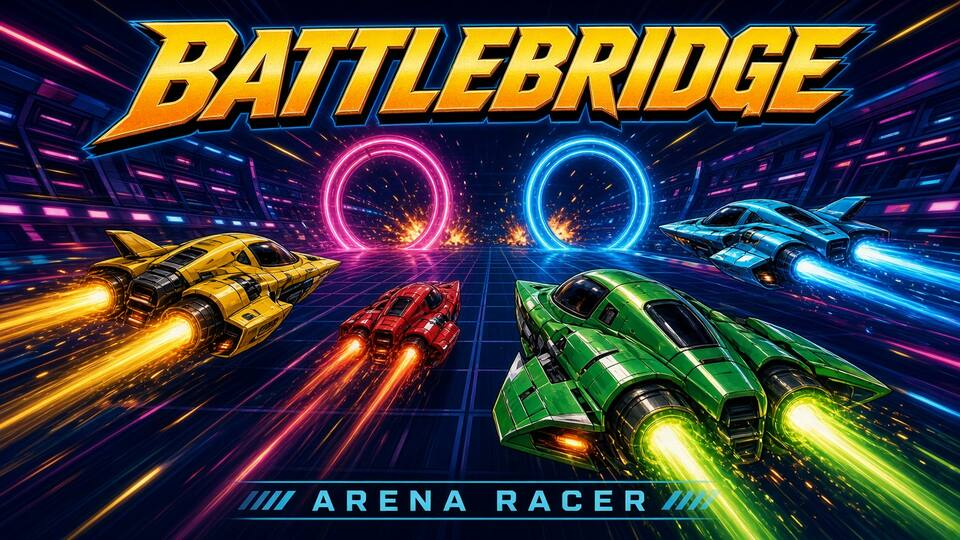
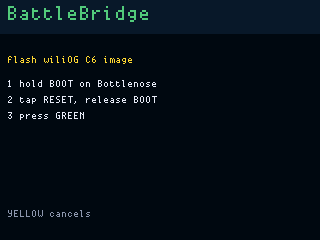
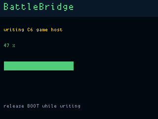

# BattleBridge

**Status:** experimental firmware in `apps/battlebridge/` (VERSION **001**).
**Fit:** add-on (Bottlenose ESP32-C6).

Four phones/laptops race and battle in a compact SubSpace/Geometry Wars-style
arena hosted entirely by Bottlenose. Each round lays a new set of walls.
Players are green / yellow / blue / red; gates cycle their own colors.
Pickups: health, shield, a heavy laser, five-shot spray, and magenta grip.
Gray-hold on the OG cycles bot skill (off / sleepy / normal / melee) into
empty seats. Blue-hold is 2v2 (P1+P2 vs P3+P4, shared gates, no friendly
fire). Matches last 90 s; a unique gate leader wins on the clock, otherwise
sudden death (next gate wins). Lasers bounce off walls; pea and spray still
die on bricks. Default motion is ice; a magenta grip pickup is what lets a
ship stop and turn quickly. Three kills in a life briefly upgrade the pea.
The landing page is a cartoon arena-racer cover. GAME OVER ranks scores (or
teams) with a star on most gates, and REMATCH is armed after a 2 s pause.
The OG LCD stays on the lobby (SSID, password, clock, bots) during play.

The C6 serves the game at `http://192.168.4.1/`, runs the authoritative
30 Hz simulation and sends binary WebSocket snapshots. Browsers render and
interpolate locally. The OG only shows the lobby, controls the C6 mode and
flashes the shared Bottlenose image.

The SoftAP is 802.11b/g/n HT20 (not 11ax), WPA2-CCMP, visible SSID, max four
stations. Open that URL after joining — there is no captive portal. The
WPA2 passphrase is eight characters from the LanFerry alphabet (no `0`, `1`,
`I`, `l`, `O`). It is stored in C6 NVS (`fwog`/`arena`) and reused across
Green toggles and C6 reboot. The C6 sends the password on `BN GAME on`; later
`BN GAME sta` lines update player/phase/heap without rewriting it. Mint a
new passphrase from the QR view (Blue tap, then Gray hold); that saves NVS,
deauths stations if the AP is up, and sends a fresh `BN GAME on` so the
WIFI QR rebuilds.

## Controls

Browser:

- keyboard: WASD move, arrows or mouse aim, left-click fires;
- touch: left half of the canvas moves, right half aims and fires;
- READY joins the next match; GAME OVER has REMATCH after 2 s;
- walk into a pickup: green health, cyan shield, gold laser, orange spray,
  magenta grip (bite the ice). Three kills without dying briefly give the
  pea a laser. The page beeps and the phone vibrates on fire, hits, gates
  and sudden death. GAME OVER ranks scores (or 2v2 teams) and stars the
  most gates.

OG:

- Green: start/stop `FWOG-arena`;
- Gray tap: force the lobby to start (or rematch from GAME OVER);
- Gray hold 700 ms: cycle bot skill off / sleepy / normal / melee (lobby);
  on the QR view, mint a new Wi-Fi passphrase instead;
- Yellow: C6 flash helper;
- Blue tap: show/hide the Wi-Fi join QR;
- Blue hold 700 ms: toggle 2v2;
- Red hold 6 s: power off.

The QR contains only the WPA network join record. The passphrase is
eight characters from the LanFerry alphabet, persisted in C6 NVS. The OG
validates a complete `BN GAME on` line before replacing the displayed
password. Blue tap then Gray hold mints a new one and rebuilds the QR.

## What to flash

1. OG — `battlebridge_main`. Do not UF2-flash `battlebridge_display`.
2. Bottlenose — **001 needs a C6 rewrite** (11n HT20 SoftAP, fail-closed
   `wifi_start`, WebSocket snapshots). **Yellow hold** on the wait or lobby
   screen programs it from this UF2 (hold **BOOT**, tap **RESET**, release
   BOOT, Green). Unplug the Orca USB-C first.

Until `BN HELLO` comes back, the panel stays on "waiting for Bottlenose".
Stock Bottlenose firmware will not speak this protocol.

Green starts and stops `FWOG-arena`. Blue tap shows the WIFI QR; Blue hold
toggles 2v2. Gray tap forces the lobby into play (or rematches). Gray hold
cycles bot skill on the lobby; on the QR view it mints a new passphrase.
Red hold ships the board.

## Screens

ogemu chrome (`fw emu battlebridge --gui`, or the headless
`tools/ogemu/scripts/battlebridge_shots.jsonl`). Synthetic `bb_status`, no C6,
no Wi-Fi. The 6×8 font is the same as the board.

| Waiting for Bottlenose | Arena AP off |
|---|---|
|  |  |

| Arena on (2v2 lobby) | Match clock (lobby) |
|---|---|
|  |  |

| Wi-Fi join QR | Landing cover (C6 page) |
|---|---|
|  |  |

| C6 flash hold | C6 writing |
|---|---|
|  |  |

Architecture, protocol, constraints and continuation notes:
[battlebridge-exploration.md](battlebridge-exploration.md).

