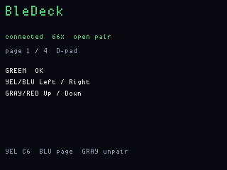
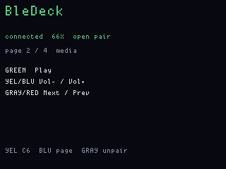
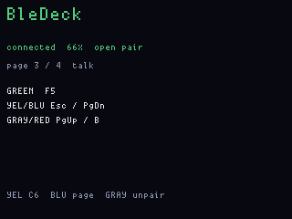
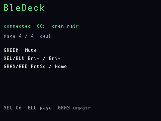
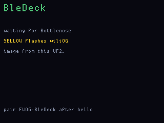
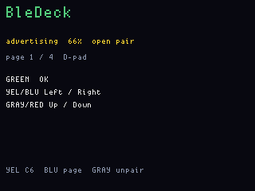
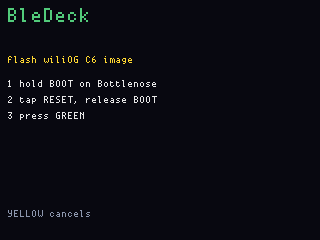
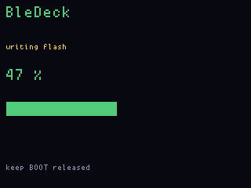
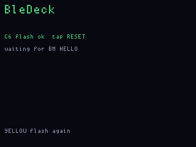

# BleDeck

**Status:** firmware in `apps/bledeck/` (VERSION **004**). Last: 2026-09-21.
**Fit:** add-on (Bottlenose).

Five buttons as a BLE HID remote to a phone or PC you pair. Complements
HostDeck: that one is wired CDC macros on **this** PC; this one is wireless
to anything that will take a keyboard.

It is a D-pad / media / talk / desk clicker, not a HID injector.

## What to flash

1. OG — `bledeck_main`. Do not UF2-flash `bledeck_display`.
2. Bottlenose — same wiliOG C6 image. **004 needs a C6 rewrite** (pairing
   lock, battery GATT, forget). **Yellow hold** on the live screen programs
   it from this UF2 (BOOT, RESET, Green), same as PingHalo. Unplug the Orca
   USB-C first. Or flash over the C6 USB-C with ESP-IDF.

Until the C6 is on this image, Windows can see **FWOG-BleDeck** and still
fail to pair: the advertiser was there, HOGP bonding was not.

After `BN HELLO` the C6 advertises **FWOG-BleDeck**. Pair in Windows
Bluetooth settings. The first successful bond **locks** advertising to that
peer so a nearby phone cannot steal the connection. **Gray hold** (~700 ms)
wipes the C6 NVS bond and opens pairing again; forget the Windows entry too
if you are switching PCs (`python tools/bledeck.py --forget`).

Green / yellow / blue / gray / red send HID down/up. The LCD line and the
WS2812 bar light the pressed colour. **Blue hold** cycles four pages.
**Yellow hold** flashes the C6. Red hold 6 s still ships.

| Page | GREEN | YEL | BLU | GRAY | RED |
|---|---|---|---|---|---|
| 1 D-pad | OK | Left | Right | Up | Down |
| 2 media | Play | Vol− | Vol+ | Next | Prev |
| 3 talk | F5 | Esc | PgDn | PgUp | B |
| 4 desk | Mute | Bri− | Bri+ | PrtSc | Home |

## Screens

ogemu chrome (`fw emu bledeck --gui`, or the headless
`tools/ogemu/scripts/bledeck_shots.jsonl`). Synthetic `bd_status`, no C6,
no Bluetooth. The 6×8 font is the same as the board.

**D-pad** (connected, open pairing, pack % from the stub charger):

Four HID pages (Blue hold) and a key-down highlight:

| D-pad | media | talk |
|---|---|---|
|  |  |  |

| desk | GREEN held (Mute) | locked to the last bond |
|---|---|---|
|  |  |  |

Waiting for hello, then advertising **FWOG-BleDeck**:

| Waiting for Bottlenose | Advertising |
|---|---|
|  |  |

Yellow-hold C6 flash:

| Hold BOOT | Writing | OK |
|---|---|---|
|  |  |  |

Pack percent on the status line is the OG pack, from BQ25896 voltage (not a
fuel gauge — USB holding the rail reads high). The C6 HID Battery Service
reports the same byte so Windows can show a battery on **FWOG-BleDeck**.

`python tools/bledeck.py` watches main CDC (`BN HID conn=` / `pair` / `enc`
/ `lock=` / `forget` / `bat=` / `disc=`). `--win` lists Windows Bluetooth
devices; `--forget` removes a stuck FWOG-BleDeck bond on the PC. Pairing
itself is ordinary Bluetooth settings — the script is a diagnostic.

Scan (PingHalo) and HID do not run at the same time on the C6; starting one
stops the other.

## What it is not

It is not HostDeck, not a USB HID gadget on the OG's own jack, and not a
payload tool. Keys are the five buttons you are holding.
