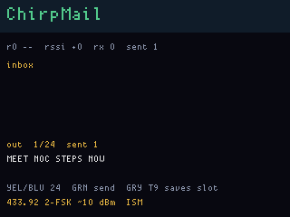

# ChirpMail

**Status:** firmware in `apps/chirpmail/` (VERSION **007**). Last: 2026-09-27.

Short text between **two OGs** on the same UF2. CC1101 **packet mode**
(2-FSK, CRC on), 433.92 MHz, ~10 dBm — TwinFox’s ISM rule, not async
OOK. This is the reason to own two boards.

Flash the same `chirpmail_main` on both. Yellow / Blue cycle **24**
canned slots (20 characters). Gray hold T9 (A–Z) **overrides the
current slot** (Green hold in T9 saves it to FatFs). Green tap sends:
the bar flashes amber and **sent** ticks up. The other board’s inbox
shows the line; its LEDs flash green.

## Helper (compose on the PC)

```
python tools/chirpmail/chirpmail.py
python tools/chirpmail/chirpmail.py --file tools/chirpmail/canned.txt push
```

The GUI is 24 entry fields. **Push to OG** writes SLOTs on **main** USB
CDC (`FWOG main chirpmail …`). Never 1200 baud. Firmware keeps the bank
in `/chirpmail/CANNED.TXT` (GlassBak / `fsbak.py` can dump it too).

T9 on the device still wins for that slot until you push again.

## Canned macros

Factory defaults occupy slots 0–7. The helper file fills more meetup
lines; empty slots are blank until T9 or a push.

| | |
|---|---|
| MEET NOC STEPS NOW | **NOC** = conference Network Operations Center. The **steps** are “I am here, come **now**.” |
| HORN HAND IS ME | look for devil horns |
| BADGE SWAP VILLAGE | exchange in a village |
| SHAKA IF YOU COPY | shaka if you heard the chirp |
| WHITEHAT WAVE 2FL | **whitehat** = friendly/ethical crowd. **Wave**. **2FL** = second floor. |
| FOX BY THE FLAG | fox is at the flag |
| ACK PIN CODE | each select mints `ACK PIN nnnn` (0000–9999). Not crypto. T9-save that slot to freeze a code. |
| SAME UF2 FIND ME | same image, find the other OG |

## Screens

ogemu panel (radios / FatFs are not in the emulator):



## Radio

Radio 0 only. 400 MHz antenna path. Fixed 24-byte payload: `CM` magic,
sequence, length, 20 ASCII bytes. Listen loops on the same chip after
each TX.

Not a mesh, not LoRa, not encrypted. Amateur / ISM rules still apply.

v007 PULLs the canned bank **once** after main is up. v006 asked every 3 s
and each reply full-wiped the LCD.

## Buttons

| | |
|---|---|
| **Yellow / Blue tap** | previous / next of 24 canned slots |
| **Gray hold** | T9 compose; Green hold saves into the current slot |
| **Green tap** | TX the compose buffer (amber LED flash, sent++) |
| **Red hold 6 s** | ship |
