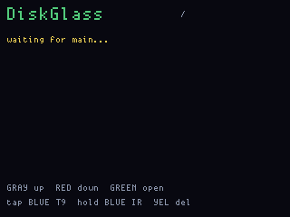

# DiskGlass

**Status:** firmware in `apps/diskglass/` (VERSION **009**). Last: 2026-09-26.

Browse the files other slate apps leave on main’s FatFs, and play the
ones that have a player. It is the library, not a USB-stick explorer.
[StickPeek](stickpeek.md) stays blocked: both RP2040s are USB devices.

Flash **`diskglass_main`**. Do not UF2-flash the display half.

**Gray** up, **Red tap** down (light-green bar). Green opens a folder
or a file. Tap Yellow back. **Hold Yellow** on a file (list or view)
asks to delete it; Green confirms, Yellow cancels. Directories are
not deleted. On a `.wasm` view: **Green tap** runs once, **hold Green**
loops it, **hold Yellow** stops and returns to the list. Red hold 6 s
still exits. **Tap Blue** on the list opens five-button **T9** to
compose a short note (Gray/Red groups, Yellow/Blue letters, Green tap
insert, Green hold done, Yellow hold backspace). Hold Blue on the list
to listen IR; tap Blue cancels listen. In a text view, hold Blue to send.

## Screens

ogemu panel (not hardware):

## Volume

Main owns the only disk: the last 8 MB of the 16 MB flash, FatFs,
`fwog_main_fs`. Display owns the glass and the I2S speaker. Listing and
file bytes travel the inter-CPU link. One open file at a time is a
FatFs rule on this BSP.

Per-app folders, 8.3-friendly names, a 48-byte `DGF1` header on binary
captures (see `dg_file.h`):

| Folder | Name | What DiskGlass does |
|---|---|---|
| `/talkclip` | `CLIP0001.RAW` | Play 8 kHz PCM on the display speaker |
| `/trailrf` | `TRAIL0001.CSV` | Show the first lines |
| `/ismburst` | `BURST0001.BIN` | Duration, RSSI, frequency; Blue ASK-replays |
| `/fobreplay` | `FOB0001.BIN` or T9 `HONDA.BIN` | Same OOK view / optional replay |
| `/` | `ismburst.bin` | Legacy ISMburst store (`IBST` magic) |
| `/` | `voltpet.bin` | Listed; VoltPet save; no player |
| `/` | `settings.txt` | Stock leftover; open as text |
| `/inbox` | `IR0001.TXT` | Notes received over IR |
| `/scripts` | `SMOKE.WASM` | DiskGlass plasma+LED smoke; Green tap once / hold loops |
| `/scripts` | `leds.wasm` | Stock IO App WASM; Green runs wasm3 |

`.txt` / `.log` / printable blobs open as a scrolling text view. Green
shows a QR of the first ~80 characters (phone scan). Hold Blue sends
up to 240 bytes over NEC IR to another OG that is listening. Composed
T9 notes and received notes both land in `/inbox` as `IRNNNN.TXT`, then
open as text. The CRC on a received note’s status line is how you
confirm a send without a second board’s phone scan. Sound-modem transfer
is not in this UF2: the display I2S is the TalkClip player, the PDM mic
is a separate PIO claim, and an acoustic path would fight both. IR is
the OG-to-OG note path.

`.wasm` files are the stock IO App’s scripts. DiskGlass runs them on
**main** with vendored **wasm3** v0.5.0. `setBoardLED` / `waitms` /
`millis` / `terminalWrite` / `showGfx` are live (LEDs and a 32×24
RGB332 tile over the link; display scales it to the panel). GPIO, radio,
FPGA, and the old GUI imports are linked as no-ops so a blink script
loads; they are not the full `fwwasm.h` device. Cap is 24 KB.

Boot writes `/scripts/SMOKE.WASM` if it is missing: 48 frames of
integer plasma plus a rainbow on the seven WS2812s, then it returns
(~3 s of `waitms`). Open it, Green tap runs once, hold Green loops.
Hold Yellow while it is running sends STOP over the link; main aborts
at the next `waitms` / `showGfx` / `call`, then the panel returns to
the file list.

A **tight** WASM loop that never calls a host function can starve
main’s kick and the RP2040 watchdog resets the board at **8.3 s**
(and takes the display down with `GUI_NRESET`). That is the runaway
backstop, not a runtime time-limit. `waitms` (sliced at 100 ms),
`m3_Yield` on WASM `call`, and `showGfx` / `setBoardLED` all kick, so
a cooperative animation can outlive 8.3 s. `waitms` is capped at 8 s
per call. SMOKE itself is finite and returns.

Format the volume from **bench** (`fs format`) — destructive, and it
does not erase leftover bytes. DiskGlass deletes **one file** at a
time from the panel.

CSV starts with `# diskglass trailrf v1` and has no binary header.
ISMburst’s `IBST` blob is understood as well as `DGF1`. microSD on
breakout SPI is [scoped](../hardware/microsd.md) and not in this UF2.

## Play

TalkClip files stream in 1 KB chunks over the link. Display plays them
on the MAX98357A at 8 kHz (`i2s_audio_start`, force mono). There is a
short seam between chunks; it is a voice note, not a studio deck.

OOK files show metadata. Blue sends four ASK frames on CC1101 radio 0
and stops — the same owned-gadget path ISMburst already paid for. It is
not a jammer. FobReplay and ISMburst still own live capture.

WAV containers, hex edit, and a `.sub` importer are later. v001 plays
raw PCM, shows CSV, and names RF blobs.

## Chrome

`fw emu diskglass` (or `ogemu_diskglass` with `scripts/diskglass.jsonl`)
is the landing list plus one injected `CLIP0001.RAW`. FatFs and the
radios are not in ogemu.

Empty volume: “waiting for main…” then “empty” with free space, or
“no FatFs volume” if mount failed. Format is a bench job, not a
front-panel gesture — auto-format would eat files to recover from a
transient read.

v009: tap Blue on the list opens T9 (shared `fwog_t9`) so you can
compose a short note, not only forward a file. Green hold saves it
through the same `PUT` path as IR receive (`/inbox/IRNNNN.TXT`).
v008: Green tap vs hold is a rising/falling `down` timer, not
`pressed` (extra press edges were resetting the hold clock, so a
hold ran once like a tap). Yellow+Green together is neither delete
nor run. Loop re-calls `_start` in one wasm3 runtime instead of
re-parsing, and parse/compile kick the watchdog. Confirm-delete
waits until Green has been released. v007: Green tap runs a WASM once; hold Green loops it; hold Yellow
stops and returns to the list. v006: wasm3 runs `/scripts/*.wasm`; hold Yellow deletes one file
after a confirm. Boot seeds `SMOKE.WASM` (plasma + LED rainbow).
A tight WASM loop with no host calls still dies at the 8.3 s
watchdog; `waitms` / `showGfx` keep cooperative scripts alive.
v005: Red tap moves down. v004 gated that edge on
`!armed`, but the 6 s exit hold arms on the same frame as the press,
so Red never moved. Gray/Red still drive a full-width light-green
bar. Back from a file fills the panel. QR is painted once. v003 added
text view, QR, and short IR notes. v002 kicked the watchdog through
FatFs so the board no longer reboot-loops.
