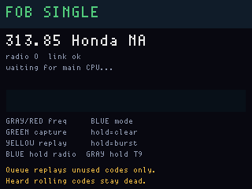

# FobReplay

**Status:** firmware in `apps/fobreplay/` (VERSION **006**). Last: 2026-09-26.

003 stops the LCD from strobing: main still sends RSSI often, but the
display no longer wipes the whole panel to show it. 004 writes each
successful capture to `/fobreplay/FOBNNNN.BIN` for [DiskGlass](diskglass.md).
**005** adds **PREDICT** mode: learn successive rolling codes and
*synthesize* the next transmission (never replay a stored waveform).
PREDICT-CTR guesses a counter field; PREDICT-KL attempts KeeLoq key
recovery and falls back to CTR when the key cannot be verified.
**006** names a copy of the last capture with the same five-button T9 map
as PingHalo (`lcd/fwog_t9.h`). FatFs **8.3** only: `HONDA.BIN` on
`/fobreplay`, collision `HONDA1.BIN`. Empty T9 keeps the auto `FOBNNNN.BIN`
from 004. ASK capture, QUEUE, and PREDICT are unchanged.

Sub-GHz ASK/OOK recorder on the two CC1101s. Display is the UI; main captures
GDO0 pulse widths in asynchronous serial mode and plays them back or synthesizes
new codes in PREDICT mode.

## Screens

ogemu panel (not hardware):

## Modes

| Mode | Capture | Yellow | Yellow hold |
|---|---|---|---|
| **SINGLE** | Overwrites slot 0 | Replay last, keep it | Burst (no-op if only one) |
| **QUEUE** | Appends up to 8 slots | Replay **oldest unused**, then mark it used | Play every unused slot, oldest first, 80 ms apart |
| **PREDICT** | Up to 8 successive codes (RAM only) | **Synthesize + TX** predicted next code | TX predicted code 3× (receiver-style) |

Blue tap cycles **SINGLE → QUEUE → PREDICT**. In PREDICT, Green hold switches
predictor sub-mode **CTR ↔ KL**.

QUEUE is the rolling-code behaviour this app implements without prediction: a
burst the car (or gate) **never received** is still a valid next code; a burst
it already heard is not. PREDICT goes further: after two or more captures whose
receiver never heard them, the app decodes bit timing, finds the incrementing
counter field, and builds a *new* waveform for counter+delta.

## Rolling codes, rolljam, and KeeLoq — in plain language

A **rolling code** is a garage-door / car-fob trick: each button press
sends a *new* number. The car remembers the last number it accepted and
ignores anything older. That is why pointing a recorded beep at a modern
car does nothing — that beep is already “used up.”

**Rolljam** is the dual-radio topology that cheats that rule: while the
real fob is pressed, one radio occupies the receiver so it cannot hear;
a second radio records the press. The receiver never got the new number,
so that number is still valid later. Two radios plus an occupy-TX.

This firmware does **not** implement that jam-leg. QUEUE is capture
out of range: you stand far from the receiver, capture several presses
it never heard, and play those. PREDICT synthesizes the *next* unused
number from the learned sequence. Same unused-number physics, no occupy-TX.

Unscoped use against a stranger's car is still theft. Authorized vehicle
or access-control RF tests on a range you are permitted to occupy are
the (1) in [retired.md](retired.md); a jam-leg for that purpose is not
catalog-forbidden. It is not this binary.

**KeeLoq** is the name of a Microchip cipher used inside a lot of those
fobs (some Honda systems historically sat in that family). The fob and
the car share a secret. Each press encrypts a counter with that secret.
PREDICT-KL attempts key recovery from captured frames; when verification
fails the app falls back to PREDICT-CTR and reports `key N` on the LCD.

So: rolling code = new number each time. KeeLoq = one common way that
number is cooked. Rolljam = unused numbers via occupy-TX. This binary =
record unused numbers by not being near the receiver, or predict the next
one from a learned counter.

## Buttons

| Input | SINGLE / QUEUE | PREDICT |
|---|---|---|
| Gray tap | Frequency presets | Frequency presets |
| Gray hold | T9 name last capture (8.3) | T9 name last capture (8.3) |
| Red tap | Frequency presets | Frequency presets |
| Green tap | Capture (tap again to abort) | Capture (tap again to abort) |
| Green hold | Clear the queue | Switch predictor **CTR ↔ KL** |
| Yellow tap | Replay one | Synthesize + transmit predicted next code |
| Yellow hold | Burst unused (queue) | Transmit predicted code 3× |
| Blue tap | Mode cycle (see above) | Mode cycle (see above) |
| Blue hold | Radio 0 / 1 | Radio 0 / 1 |
| Red hold 6 s | Power off | Power off |

## T9 file names (006)

Gray hold opens **FOB NAME**. Buttons match PingHalo:

| Input | T9 |
|---|---|
| Gray / Red | Previous / next letter group (`ABC` … `WXYZ`) |
| Yellow / Blue tap | Previous / next character in the group |
| Green tap | Insert (max 8, A–Z) |
| Green hold | Save `/fobreplay/STEM.BIN` (empty buffer: cancel, keep `FOBNNNN.BIN` only) |
| Yellow hold | Backspace |

The live ASK capture, unused-code queue, and PREDICT synth/TX stay on the
main screen. T9 only archives the last RAM burst under a human 8.3 name.

Presets: 313.85 MHz (Honda NA), 315, 433.92, 868.35, 915.

## Hardware

Main CC1101s, display antenna expander (`FWOG_ANT_200/400/900MHZ`), LCD
timing strip, LED bar = unused-slot count (QUEUE) or capture count (PREDICT).

## Use

Hold **your** fob a few inches from the OG, Green, press the fob. In QUEUE,
press the fob several times **out of range of the vehicle**, then Yellow
replays those unused codes in order. In PREDICT, capture the same way (2+
presses minimum), watch the LCD for counter/frame hex and key status, then
Yellow to transmit the synthesized next code.

If the car already heard a press, replay of that same waveform will fail on
any modern rolling-code RKE. Fixed-code ISM remotes (cheap doorbells, some
older gates) replay forever.
