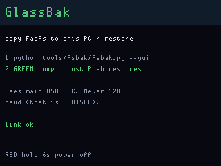

# GlassBak

**Status:** firmware in `apps/glassbak/` (VERSION **001**). Last: 2026-09-25.

Copy the main CPU’s **FatFs** volume (last 8 MB: `OPTIC.BIN`, `PHLIB.BIN`,
`mscope.cal`, TalkClip `.RAW` clips, trail CSV, …) onto this PC — and **put the
same files back on the same `/` paths** so OpticClick, PingHalo, MicScope,
and the rest open them as before. The OG is a USB **device**, not a stick
— [StickPeek](stickpeek.md) stays blocked — so the bytes travel as hex on
**main USB CDC**.

Flash **`glassbak_main`** only (never the display UF2), **or** use the
**GlassBak tile in KitHome 002** (`kithome_main`) if you already live on
that combo (MicScope quiet-cal lives on FatFs).

## Screens

ogemu panel (not hardware):



## On the board

1. Flash GlassBak or KitHome. Open the GlassBak tile (KitHome: Gray/Red,
   Green).
2. On this PC: `python tools/fsbak/fsbak.py --gui` (or CLI below). Never
   1200 baud.
3. **Green** on the OG starts the dump. Main CDC prints `FSBK1` …
   `FILE /name size` … hex … `END`.
4. **Push** in the helper sends `PUT /name size` plus hex. Firmware
   recreates parent directories and writes those exact paths.

**Red hold 6 s** still powers off.

## Host helper

```text
python tools/fsbak/fsbak.py --gui
python tools/fsbak/fsbak.py
python tools/fsbak/fsbak.py --out backups/og-2026-09-25
python tools/fsbak/fsbak.py --push --out backups/og-2026-09-25
python tools/fsbak/fsbak.py --push --app OpticClick
python tools/fsbak/fsbak.py --list
python tools/fw.py fsbak -- --gui
```

The GUI groups host files by the app that owns the FatFs name
(`OPTIC.BIN` → OpticClick, `PHLIB.BIN` → PingHalo, `mscope.cal` →
MicScope, `/talkclip` → TalkClip (`RAW` plus host `.wav`), `/trail` / `/trailrf`, `/ismburst`,
`/fobreplay`, `/scripts` → DiskGlass). Push selected rows, or the whole
tree. Paths on the wire always start with `/`. After a dump, each TalkClip
`CLIP*.RAW` (48-byte `DGF1` + 8 kHz PCM) also gets a sibling `.wav` on the
PC (`ffmpeg` if it is on PATH, else Python `wave`). Push leaves those
`.wav` files on the host.

It opens **main** CDC only (`093C:2054` / `FWOG main glassbak …` or
`kithome`). Press Green after the helper is listening so USB has
enumerated.

## Related source

| Path | Purpose |
|---|---|
| `apps/glassbak/display/main.c` | Green → dump command on the link |
| `apps/glassbak/gb_fs.c` | Walk FatFs, hex dump, PUT restore (shared with KitHome) |
| `apps/kithome/` | Combo tile + same `gb_fs.c` on main |
| `tools/fsbak/fsbak.py` | Host reconstruct + GUI + Push |
