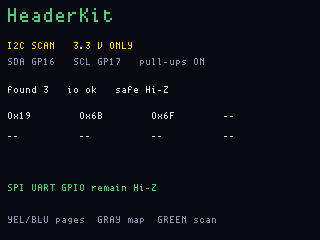
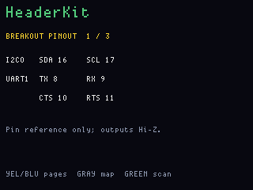
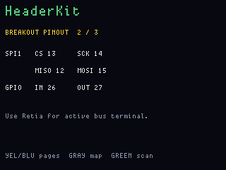
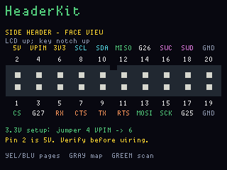
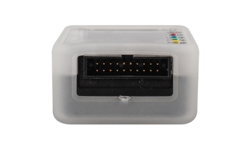
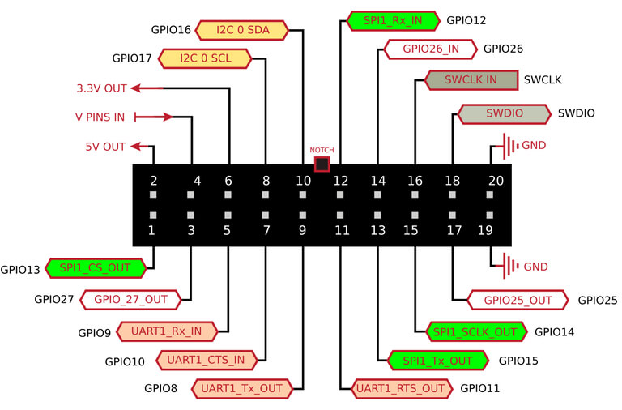

# HeaderKit

**UNTESTED — USE AT OWN RISK.** This firmware has not been proven on a
physical OG. ogemu covers LCD chrome only. Do not treat the pin map,
Hi-Z policy, or I2C scan as verified hardware.

**Status:** firmware in `apps/headerkit/` (VERSION **004**). Last: 2026-09-22.

HeaderKit is a safe, front-panel reference and I2C scanner for the OG's
3.3 V breakout. Green scans I2C; Yellow/Blue move through three pinout pages;
Gray jumps straight to the side-header face view. It does not drive SPI,
UART or GPIO.

v004 adds an on-device physical connector map with the same orientation as
the side-view reference below. v003 adopted Retia's Hi-Z-first pin policy.
The generic BSP direction defaults
enable several SPI/UART/GPIO outputs, so using those defaults for an I2C-only
app was unsafe. HeaderKit now explicitly leaves every unrelated breakout
signal as an input and enables only the I2C pull-ups before scanning.

## Screens

I2C scan:

Pin reference:

Gray-button physical connector map:

## Physical header orientation

Look straight into the OG's side connector with the LCD and colored button
legend facing up. The key notch is on the upper edge. Even pins 2–20 run
left-to-right across the top row; odd pins 1–19 run left-to-right across the
bottom row.

For HeaderKit's 3.3 V setup, jumper **pin 4 (`V PINS`) to pin 6 (3.3 V)**.
Pin 4 powers the level-shifter I/O side; without that connection the digital
header is dead. Pin 2 is 5 V—do not connect it to a 3.3 V peripheral.

The physical view and pinout are preserved from the
[legacy FreeWili documentation](https://github.com/wskellenger-intrepid/FreeWili_WebDocs/tree/main/docs/assets).

## Breakout map

- I2C0: SDA GPIO16, SCL GPIO17; pull-ups enabled while scanning.
- UART1: TX GPIO8, RX GPIO9, CTS GPIO10, RTS GPIO11.
- SPI1: CS GPIO13, SCLK GPIO14, MISO GPIO12, MOSI GPIO15.
- GPIO: input GPIO26, output GPIO27.

HeaderKit documents and scans the **3.3 V** setup. The OG level shifters can
use another supported `V PINS` voltage, but the connected peripheral and
power wiring must match it.

## HeaderKit versus Retia

HeaderKit is the glanceable workshop card: identify pins and safely discover
I2C addresses without a computer. [Retia](retia.md) is the Bus Pirate-style
USB CDC terminal for active GPIO, I2C, UART and SPI operations.

The main RP2040 owns the breakout. Its FPGA I/O buffer and PCAL6416
directions must stay synchronized through `fwog_io_dir_apply()`.
