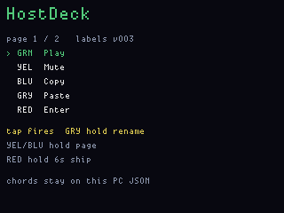

# HostDeck

**Status:** firmware in `apps/hostdeck/` (VERSION **003**). Host helper in
`tools/hostdeck/` (2026-09-11). Last: 2026-09-26.

v003 draws the five-button labels and lets you **T9-rename the LCD text**
(Mute, Paste, …). Chords and `--payloads` stay on the host helper JSON —
T9 never edits a chord or a payload index. v001/v002 already print the
intended chord on **this** PC’s display CDC. A Windows helper
(`python tools/hostdeck/hostdeck.py`) reads those `MACRO` lines and types
the chord into the focused window via SendInput. TinyUSB HID is **not**
used and is not required: adding a composite CDC+HID device would mean
replacing `stdio_usb_descriptors.c`, which is the same descriptor set
1200-baud BOOTSEL rides on — the display CPU’s only remote recovery.

A five-button Stream Deck for the computer **this** OG is plugged into.
Each colour is a macro: paste a snippet, send a hotkey chord, play/pause,
mute. The LCD shows the current page of labels. Yellow/blue page
left/right if you outgrow five slots.

This is the operator-at-the-keyboard remainder of HID: the tester is
sitting at that machine, installed the helper, and asked for the
keystrokes. Authorized HID toward an in-scope host (a Rubber-Ducky-class
stick) is a separate pentest idea and is not retired — see
[retired.md](retired.md). HostDeck does not enumerate TinyUSB HID.
The helper also accepts KitHome's display product string
(`FWOG display kithome …`), because that landing prints the same
`MACRO` lines.

## Screens

ogemu panel (not hardware):



## Rename a label (T9)

HostDeck has no FatFs volume of its own, so names live in RAM until reset.
Re-enter T9 on the same slot to keep editing.

1. Tap the colour whose strip you want (the `>` cursor follows the last
   tap). Example: tap **Yellow** so `>` sits on Mute.
2. **Hold Gray ~750 ms** — T9 opens on that slot. Gray tap still fires
   Paste/Tab; a hold does not.
3. Same map as PingHalo T9: **Gray/Red** letter-group, **Yellow/Blue**
   character in the group, **Green tap** insert, **Green hold** done,
   **Yellow hold** backspace.
4. Green hold writes the LCD string only. The CDC line still carries the
   firmware chord (`Consumer Mute`, `Ctrl+C`, …) or `HOSTDECK payload=`.
   Key host JSON by `page:slot` (for example `0:1`) so a renamed Mute
   still matches.

Red hold 6 s still ships the board (`FWOG_POWER_DEFAULT` + `fwog_power_poll`).

## Hardware

Both RP2040s are USB **devices** (CDC). HostDeck talks to the host through
the display CPU’s existing CDC console (VID/PID `093C:2055`, product
`FWOG display hostdeck 003`). The helper identifies that port the same way
`fw.py` does — PID 2055 first, then the `FWOG display ` prefix — and
refuses the main CPU (`093C:2054`). It opens at 115200, never 1200 (1200
reboots BOOTSEL).

## Host helper

```
python tools/hostdeck/hostdeck.py
```

`--dry-run` prints chords without typing. `--list` shows which COM port is
HostDeck. Details and the chord map: [`tools/hostdeck/README.md`](../../tools/hostdeck/README.md).

## What it is not

It is not a Rubber Ducky. No “plug into a machine you do not control.”
Macros fire only while this helper is running on the authorized PC that
has this cable. There is no unattended payload runner and no TinyUSB
keyboard toward a stranger’s machine.

## Why it is a good OG app

The five colour buttons are already a keypad. The LCD is already a label
strip. A Stream Deck is exactly that product with a nicer name.
