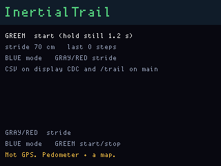
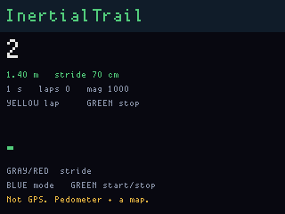
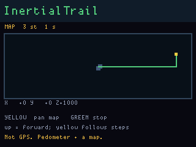

# InertialTrail

**Status:** firmware in `apps/inertialtrail/` (VERSION **008**). Last: 2026-09-26.

A walking logger on the display accelerometer. The honest product is a
**pedometer with a clock**, not indoor GPS. MAP mode plots one stride per
detected step. The origin stays at the centre of the plot so the yellow
you-dot actually walks. A walk is also written to FatFs
`/trail/WALKNNNN.CSV` (or an optional T9 8.3 title) for
[DiskGlass](diskglass.md).

v008 adds a PingHalo-style T9 walk title (Gray hold on idle). Empty title
keeps `WALKNNNN.CSV`. A short name becomes `NAME0001.CSV`; eight letters
become `NAME.CSV`. Flash the **main** UF2. Do not UF2-copy
`inertialtrail_display.uf2` by itself.

**Leave Bottlenose / the C6 Orca off.** UART1 on the header is the C6
link; this app does not use it. A GNSS module can occupy that UART
later (see [InertialTrailRF](inertialtrailrf.md)); a Bottlenose on the
same pins cannot.

## Screens

Idle:



Pedometer run:



Map (origin-fixed, yellow you-dot):




## What the silicon actually is

The LIS3DH sits on the **display** CPU, I2C address 0x19, on the same bus
as the RTC and the charger. The BSP talks to it at 100 Hz in normal
(10-bit) mode. Stock FreeWili docs say Z points out of the screen and X
points toward the IO connector.

There is no gyroscope and no magnetometer, so the board cannot keep a
heading the way a phone does. There is no GPS. The LIS3DH interrupt pins
are **not wired** to a GPIO — only I2C is on the pin map — so a
pedometer here is software looking at the 100 Hz samples, not a hardware
step interrupt.

The **main** CPU owns the only filesystem (`fwog_fs`, FatFs on the last
8 MB of flash). Display has the sensor, the screen, the buttons, and the
real-time clock. A trail that should survive power-off crosses the
inter-CPU link as `IT_MSG_LOG` and lands on main as `/trail/WALKNNNN.CSV`
or a T9-titled 8.3 name in the same folder.

## Two modes

**PEDO (the one people will actually use).** Green, hold still ~1.2 s so
the firmware can learn the rest vector (gravity plus bias) and the dead
zone width from how noisy that hold was. Then walk. Each step is a
residual-acceleration **peak that has fallen** back through half the
threshold, with 380 ms dead-time so heel bounce cannot count twice.
Threshold starts from the still dead zone and then walks toward half the
recent peak height. While you are inside the dead zone the rest vector
keeps tracking, so a slow tilt or a warm bias walk is absorbed instead
of counted. Distance is `steps × stride`. Stride starts at 70 cm
(Gray/Red, 40–150 cm).

That does not tell you *where* you walked, only *how far* and *when*.
The LCD shows a big step count, distance, elapsed time, and a sparkline
of steps per second.

**MAP (stride PDR, not double-int).** Same hold-still seed and the same
step detector. Each counted step strokes **one** segment of stride length.
Heading is taken from residual X/Y **at the bounce peak**, not the
valley — the falling edge is when a walking pitch dumps gravity toward
the buttons (your still board is about `X+44 Y−12 Z+1016`). Sensor +Y
is flipped onto the plot so screen-up is forward. XY weaker than 180 mg
keeps the last heading (default: up). 8-way snap still kills noise
diagonals. The camera stays on the origin unless you pan. Live X/Y/Z
under the plot are raw milli-g.

The header is **InertialTrail**, not a mode name.

## Buttons

| Input | Action |
|---|---|
| Blue | Idle: pedometer ↔ map. Scroll: pan right. T9: next letter |
| Green | Idle: start cal (tap). Cal: cancel. Scroll: leave. Run: stop. T9: tap insert, hold done |
| Yellow | Pedometer run: lap. Map run: enter scroll (then pan left). T9: tap prev letter, hold backspace |
| Gray / Red tap | Stride −/+ 5 cm, or pan up/down in scroll. T9: Gray/Red change letter group |
| Gray hold (~750 ms) | Idle: T9 walk title (empty → `WALKNNNN.CSV`) |
| Red hold 6 s | Power off (flushes `/trail` first) |

## Live CSV (display CDC)

Attach with `python tools/fw.py console --product "FWOG display "`
(`console` has `--port` / `--product`, not `--cpu`; `--cpu` is
`fw bootsel`). Any serial program that is **not** 1200 baud. 1200 baud
is BOOTSEL. See [console.md](console.md).

Pedometer:

```
# inertialtrail v008 mode=pedo stride_cm=70 rest=... dead=... thresh=... title=-
kind,ms,steps,dist_cm,mag,laps
step,<ms>,<steps>,<cm>,<mag>,<laps>
mark,<ms>,...
```

Scribble / map (thinned, not 100 Hz):

```
kind,ms,x,y,laps
xy,<ms>,<x>,<y>,<laps>
```

`x`/`y` are centimetres from the start, one stride per step.

## FatFs (`/trail`)

Main writes `/trail/WALKNNNN.CSV` when a take starts, unless you set a T9
title first (Gray hold on idle, same keys as PingHalo). DiskGlass lists it.
The first lines are `# diskglass inertialtrail v2 mode=… title=…` then
`kind,ms,steps,dist_cm,mag,laps,x,y`. A ship-arm or Green-stop closes the
file. That is the dump path. The USB gadget stays CDC so 1200-baud
BOOTSEL still works.

Related: [InertialTrailRF](inertialtrailrf.md) hangs the CC1101s on the
same walk clock and writes `/trailrf/TRAILNNNN.CSV` (or a T9 title).

## What we do not claim

This is not indoor positioning. It is not a fitness-watch replacement.
The pedometer will miss slow shuffles and double-count a bumpy car ride
until the threshold is tuned on a real walk.

## Flash

```
python tools/fw.py build inertialtrail_main
fwogcli flash build/apps/inertialtrail/inertialtrail_main.uf2 --cpu main --yes
```

USB product strings: `FWOG display inertialtrail 008` and
`FWOG main inertialtrail 008`.

Boot and ship splashes are the shared display helper (`fwog_splash_bind`).
