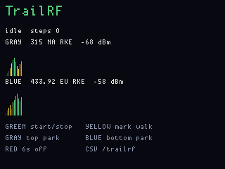
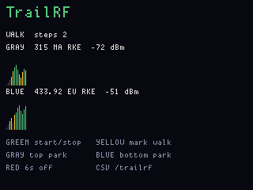

# InertialTrailRF

**Status:** firmware in `apps/inertialtrailrf/` (VERSION **009**). Last: 2026-09-26.

The same rest-calibrated peak-valley pedometer as
[InertialTrail](inertialtrail.md) **008**, plus **two** parked CC1101
RSSI meters (15 s strips). **Gray** picks the **top** park, **Blue**
the **bottom**. Gray hold on idle opens a PingHalo-style T9 walk title.
Flash the **main** UF2.

**Leave Bottlenose / the C6 Orca off.** These two trail apps own the
sub-GHz radios and FatFs. UART1 on the header is the Bottlenose link;
this image does not talk to a C6. If a module is on the header, unplug
it before you walk.

A walk is CSV on the display CDC and `/trailrf/TRAILNNNN.CSV` on main
FatFs for [DiskGlass](diskglass.md) (optional T9 title instead of only
`TRAILNNNN.CSV`). A red ship-arm flushes the file.

## Screens

Idle, Gray = 315 MHz (top) and Blue = 433.92 MHz (bottom):



Walk, two steps:



## Two parks (Gray top / Blue bottom)

The board has **two** CC1101s. Radio 0 feeds the top 15 s strip, radio 1
the bottom. Each LO is an exact Hertz plus the ~812 kHz RX filter
described below. Defaults: top **315 NA RKE**, bottom **433.92 EU RKE**.
Each key walks 315 → 433.92 → 868.35 → 915 and retunes that radio’s
antenna path (200 / 400 / 900 MHz). Both strips can sit on the same
centre if you want.

A third band would need hopping. Not in this UF2.

## Why 433.92 MHz (and 315)

The radio **sits still** (zero-span). It does not sweep. Defaults are
**315 MHz** on top and **433.920 MHz** on the bottom because:

- It is the common EU/Asia 70 cm ISM centre for key fobs, alarms, and
  garage kits (FobReplay’s “433.92 EU RKE”). North-American fobs are
  usually **315 MHz** — that is the default **top** strip (Gray).
- Each radio’s antenna path follows its park. 315 uses 200 MHz; 433.92
  uses 400 MHz; 868.35 / 915 use 900 MHz.
- [BandScope](bandscope.md) is the sit-still *sweep*. This app is
  “how loud were these two centres at step N.”

The LO is programmed to that **exact Hertz**, but the CC1101 is not a
1 Hz spike. Bring-up leaves MDMCFG4 at `0x0B`, which is an **~812 kHz**
RX channel filter (26 MHz / 32). Energy roughly ±400 kHz around the
park still moves the RSSI. That is wide enough to catch a 313.85 MHz
Honda fob when you parked on 315, and noisy enough that two loud
neighbours look like one blob. Widening it further buys more of the
ISM allocation and more noise; narrowing it is how you tell two
carriers apart. A *range* of hundreds of MHz is a **sweep**
(BandScope), not a wider filter.

## Buttons

| Input | Idle | Cal | Walk |
|---|---|---|---|
| **Green tap** | Start 1.2 s rest-cal, open `/trailrf` | Cancel, close the file | Stop, close the file |
| **Green hold** | (T9: done) | — | — |
| **Gray tap** | Next **top** park (radio 0) | same | same |
| **Gray hold** | T9 walk title (empty → `TRAILNNNN.CSV`) | — | — |
| **Blue tap** | Next **bottom** park (radio 1) | same | same |
| **Yellow tap** | — | — | Stamp a `mark` row |
| **Red tap** | unused (T9: next group) | unused | unused |
| **Red hold 6 s** | Power off (flushes `/trailrf`) | same | same |

T9 (idle, after Gray hold): same keys as PingHalo — Gray/Red change
group, Yellow/Blue change char, Green tap inserts, Yellow hold
backspaces, Green hold saves the 8.3 stem and returns to idle.

## RSSI bars

Two rows, 150 columns × 100 ms ≈ **15 s** each. Height −110 dBm to
−40 dBm. Green ≥ −70, yellow ≥ −90, dim below.

## What gets recorded

```
# diskglass trailrf v4 title=-
kind,step,rssi0,rssi1,freq0_hz,freq1_hz
step,<n>,<dBm>,<dBm>,<Hz>,<Hz>
mark,<n>,<dBm>,<dBm>,<Hz>,<Hz>
```

Display CDC uses the same columns (`# trailrf v009`). Empty T9 title
writes `TRAILNNNN.CSV`; a titled walk uses that 8.3 stem under `/trailrf`.

## GPS / LilyGo T-Echo

Stock OG has **no GNSS**. The OG is also **not a USB host**, so a
T-Echo on USB-C talks to a PC, not to this board.

**USB-C on the T-Echo, stock Meshtastic:** you get the Meshtastic
protobuf API for the phone app, **not** a stream of `$GPxxx`. You do
**not** need a custom firmware image. Enable the Serial module and
point it at the USB console:

```
meshtastic --set serial.enabled true
meshtastic --set serial.override_console_serial_port true
meshtastic --set serial.mode NMEA
```

After reboot, that USB CDC is NMEA at **38400** 8N1 (`$GNGGA` every
2 s, plus `$GPWPL` for mesh nodes). That is config, not a reflash.
Useful on a laptop. Useless to the OG until something USB-hosts it.

**Into this board:** wire 3.3 V NMEA into **header UART1 RX (GPIO 9)**.
The T-Echo does not bring a spare UART to a connector; the practical
taps are the L76K TX pad (native 9600 NMEA, no Meshtastic) or a
USB-UART dongle from the T-Echo’s NMEA CDC. Leave Bottlenose off.
This UF2 does **not** parse `$GPGGA` yet.

## What it is not

It does not decode other people’s remotes, jam, or wardrive Wi-Fi.
Heading / map live on [InertialTrail](inertialtrail.md).

## Split of labour

Display: LIS3DH, UI, step detector, CDC, antenna switch. Main: both
CC1101s parked, FatFs `/trailrf`. Dual RSSI travels as `TRF_MSG_ST`.

USB product strings: `FWOG display inertialtrailrf 009` and
`FWOG main inertialtrailrf 009`.

```
python tools/fw.py build inertialtrailrf_main
python tools/fw.py flash inertialtrailrf_main
```
