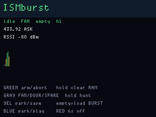
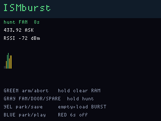
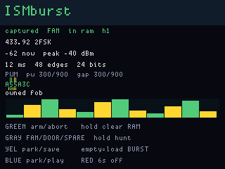

# ISMburst

**Status:** firmware in `apps/ismburst/` (VERSION **007**). Last: 2026-09-26.

Was SkyBurst v001 (433.92 listen, burst/RSSI, “decode later”). v002 renamed
the app and actually captured a burst into RAM, then ran a small
rtl_433-style analysis on the OG. v003 keeps that capture ring, raises the
weather-label bar so a fan/doorbell is not called a weather station, and
adds **store + replay for ISM gadgets you own**. v004 also archives each
save as `/ismburst/BURSTNNNN.BIN` so [DiskGlass](diskglass.md) can list it
(and ASK-replay it). v005 is the panel: a live **15 s RSSI strip** while
you wait, an **arm countdown**, **hunt**, readable colour-named keys, and a
taller pulse histogram on a decode.

v006 names the three RAM slots **FAN / DOOR / SPARE**, loads
`/ismburst/BURSTNNNN.BIN` into the current slot, parks **2-FSK** as well as
ASK, and runs the same edge-histogram decode on the FSK bitstream.

v007 adds a **T9** nickname on the current slot (**Red tap**). Same letter
map as PingHalo (`lcd/fwog_t9.h`): Gray/Red group, Yellow/Blue letter,
Green tap insert, Yellow hold backspace, Green hold save. Empty save
restores FAN/DOOR/SPARE. Names persist as `/ismburst/FAN.TXT` (and
`DOOR.TXT` / `SPARE.TXT`) beside the existing BIN store. Decode protocol
strings in `decode.c` / `ib_status_t.label` are unchanged.

`ismburst.bin` is still the file this app reloads. Named stores are
`/ismburst/FAN.BIN`, `DOOR.BIN`, and `SPARE.BIN`. Optional T9 names are
`/ismburst/FAN.TXT`, `DOOR.TXT`, and `SPARE.TXT`.

rtl_433 is a PC program for RTL-SDR / SoapySDR. The OG has a CC1101, not an
SDR. This is an on-device slice: pulse histogram, PWM vs PPM vs Manchester,
bit packing, and a few weather/ISM families **when the heuristic is
confident**. It is not a SKU database of remotes.

Replay uses the same CC1101 async-serial TX path FobReplay already paid
for. It sends the stored edge timings a few times, then **stops**. It is
not a jammer, not rolljam, not KeeLoq / Honda prediction, and not an
unused-code queue for cars.

## Screens

Idle listen, 15 s RSSI strip at 433.92 ASK (FAN empty):

Hunt/arm, waiting for a GDO0 edge:

One owned fixed-code shot decoded:

433.92 2-FSK park (Blue tap past the ASK bands):

## Capture then decode

1. **Idle** — radio sits on an ISM frequency (default 433.92 MHz ASK). RSSI
   and a heard-burst count update in place. The strip is 150 columns ×
   100 ms ≈ 15 s (−110..−40 dBm). No waveform is stored until you arm,
   unless a named slot or `ismburst.bin` was saved earlier.
2. **Arm** — Green tap. Main waits up to 12 s for a GDO0 edge with RSSI
   above −85 dBm (same “need an edge, not just a bump” rule as FobReplay).
   The LCD shows remaining seconds.
3. **Hunt** — Gray hold. Same wait, then auto-rearm until FAN, DOOR, and
   SPARE all have edges, or you abort. Green tap while armed still aborts.
   Empty named slots fill first.
4. **Capture** — up to 512 edge durations (~1 KB), 4 s cap or a 25 ms
   quiet gap. Peak RSSI, total microseconds, and ASK vs 2-FSK are kept
   with the edges.
5. **Decode** — `decode.c` on main (host-tested). Coding + hex first. A
   protocol *name* only when confidence is high. Compact summary over the
   link (88 bytes). The waveform stays on main. **2-FSK** uses the same
   GDO0 async-serial bitstream, so PWM / PPM / Manchester and Oregon-like
   MC still run; ASK-only names (PT2262, TPMS-shaped) stay off that path.
6. **Slots** — FAN, DOOR, SPARE. Gray tap pages them (empties included).
   **Red tap** opens T9 to rename the current slot (or SPARE). Green hold
   on that keyboard writes `/ismburst/<SLOT>.TXT`.
7. **Save** — Yellow hold on a slot that has edges writes that shot to
   `ismburst.bin` (reload), `/ismburst/<SLOT>.BIN`, and
   `/ismburst/BURSTNNNN.BIN` (DiskGlass archive).
8. **Load** — Yellow hold on an **empty** slot loads the next
   `/ismburst/BURSTNNNN.BIN` into that slot (cycles the archive).
9. **Replay** — Blue hold TX's the current shot (RAM, or the named disk
   copy if RAM is empty) **4 frames** with 25 ms gaps, then returns to RX.
   The radio retunes to the shot’s frequency **and** ASK/2-FSK. Never
   continuous TX.

## What actually runs on the OG

The LCD prefers **coding (PPM / PWM / MC) + hex**. Names below are a
heuristic, not a lookup table of devices. rtl_433 protocol 3 (Prologue) has
**no checksum**; v002 slid a 36-bit window across every offset and both
polarities, which is how a fan remote printed “Prologue weather”. v003
refuses that.

| Guess | What it is |
|---|---|
| PWM / PPM / Manchester | Histogram + two-means on pulse vs gap widths (`rtl_433 -A` idea). Shown as coding + hex. FSK labels say FSK |
| Prologue weather | **Heuristic**, not a SKU. Aligned 36-bit PPM (or repeating 36-bit rows), ~500/2000/4000 µs timing, type nibble 0x9 or 0x5, temp −40..60 °C, humidity 0..100 or 0xCC (rtl_433 protocol 3). DIAG traces accept/reject. ASK only |
| Nexus weather | Same no-slide rule; 36-bit PPM ~1000/2000 µs, const 0xF (protocol 19). ASK only |
| Oregon-like MC | Manchester with a run of ≥12 ones (protocol 12 family). Hex dump; no full Oregon device table. ASK and 2-FSK |
| PT2262-like OOK | 24-bit 1:3 PWM — doorbells / fixed-code remotes you own. Hex only. ASK only |
| fixed-code OOK / FSK | 20–40 bit PPM/PWM that is not a confident weather frame |
| TPMS-shaped | Short, fast 315/433 burst. **No OEM decode.** Use [TireEar](tireear.md). ASK only |

Unknown still shows duration, peak RSSI, bit count, coding guess, and hex.
A USB CDC line on main logs coding, bit count, hex, pulse/gap, and why a
Prologue candidate was kept or dropped.

## Buttons

| Input | Action |
|---|---|
| **Green tap** | Arm one shot (tap again to abort) |
| **Green hold** | Clear the RAM ring (disk store stays) |
| **Gray tap** | Page FAN → DOOR → SPARE |
| **Gray hold** | Hunt: auto-rearm until named slots are full |
| **Yellow tap** | Previous park (315 / 433.92 / 868.35 / 915 ASK, then 433.92 / 868.35 2FSK) |
| **Yellow hold** | Save current shot, or **load next BURST\*.BIN** if the slot is empty |
| **Blue tap** | Next park |
| **Blue hold** | Replay current shot, 4 frames, then stop |
| **Red tap** | Name the current FAN/DOOR/SPARE slot (T9) |
| **Red hold 6 s** | Power off (`fwog_power_poll` / ship) |

On the T9 screen: **Gray/Red** change letter group, **Yellow/Blue** change
character, **Green tap** inserts, **Yellow hold** backspaces, **Green hold**
saves (PingHalo map, `fwog_t9`).

LCD store line: **saved** / **playing** / **in ram** / **no store**. Status
line names the slot (`FAN` / `DOOR` / `SPARE`, or the T9 nickname).

## Not this app

This firmware is ISM ASK/2-FSK capture, heuristic decode, and owned-gadget
store/replay (a ceiling-fan remote, a doorbell). It is not the place to
grow a denial transmitter, a rolling-code jam-leg, a cipher predictor,
HID, a payment reader, or a cellular stack.

Authorized pentest tools that *this board's silicon can actually run*
are scoped in [retired.md](retired.md), not refused here. Stay out of
what this PHY cannot do, and out of other apps' jobs:

- unused-code queues for cars (that is [FobReplay](fobreplay.md))
- magstripe / EMV / NFC payment, cellular IMSI catchers (wrong silicon)
- copying rtl_433’s TPMS OEM tables (TireEar’s page) or its car-key decoders
- POCSAG, Wireless M-Bus, the rest of rtl_433’s 200+ protocols

Weather ISM, doorbells you own, temperature sensors, “unknown OOK dump”,
and playing back a capture from something on your desk are the point.

## Flash

`fw build ismburst_main && fw flash ismburst_main`

Do **not** UF2-flash `ismburst_display`. The display image is embedded in the
main UF2 and arrives over the link with metadata.

USB product strings: `FWOG display ismburst 007` and
`FWOG main ismburst 007`.

## Hardware

Main CC1101 radio 0, ASK/OOK or 2-FSK async serial on GDO0 (same PHY as
FobReplay capture **and** TX). ASK uses ~10 kbaud / 270 kHz IF; 2-FSK uses
~2.4 kbaud / 162 kHz IF / 25.4 kHz deviation. Display antenna expander
follows the preset (200 / 400 / 900 MHz). Main links `fwog_main_fs` for
`ismburst.bin` and `/ismburst` (BIN captures plus optional `FAN.TXT` /
`DOOR.TXT` / `SPARE.TXT` T9 names).
