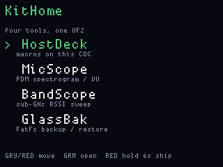

# KitHome

**Status:** firmware in `apps/kithome/` (VERSION **007**). Last: 2026-09-27.

One display image, eight tools, **four tiles per page** (PinDesk scale:
scale-2 names + blurbs). Scroll past the last row of a page to the next
page; `^` / `v` in the right corners when there is more before or after.
**Gray tap** up, **red tap** down; green opens. From inside a tile,
**yellow / green / gray hold** (~0.7 s) returns home. Opening a tile
(and going home) full-clears the panel. Red hold 6 s ships.

Flash **`kithome_main`** (it carries the display image). Do not UF2-flash
the display half.

## Screens

ogemu panel (not hardware):

| Tile | What you get |
|---|---|
| **HostDeck** | Five-button macros on this CDC (same chords as the standalone app) |
| **MicScope** | PDM spectrogram / VU. Mic is inited once at boot and left running. Quiet-cal is FatFs (`mscope.cal`) |
| **BandScope** | CC1101 RSSI sweep. Main idles the radio on every other tile |
| **GlassBak** | Dump / restore main FatFs over USB CDC. Green dump; host `fsbak --gui` Push writes files back to the original `/` paths |
| **DiskGlass** | FatFs, T9/IR, QR, PCM I2S, ASK replay, wasm3. Member holds moved to **BLUE** |
| **TalkClip** | VAD clips → `/talkclip`. **BLUE tap** hang; **BLUE hold** T9 rename |
| **ToneBox** | Museum + sequences + I2S; 2600 on PDM; header relay **H** on UART1 |
| **RigGlass** | Host telemetry parser on **main USB CDC** |

Yellow *tap* inside BandScope still changes band. A yellow/green/gray
*hold* (~0.7 s) is home, so it does not also step the band, freeze, hunt,
or fire a HostDeck chord. T9 backspace is gone (yellow hold is HOME);
T9 cancel is gray-hold HOME.

Main listens for `KIT_MSG_SEL` (`kit_proto.h`). **PDM** (pio0 SM1) is
exclusive MicScope vs TalkClip vs ToneBox 2600. **I2S** (pio0 SM2) is
DiskGlass PCM or ToneBox speaker. **Radio0** is BandScope, or DiskGlass
only while REPLAY. HostDeck and idle tiles do not keep the PA warm.
GlassBak uses the same `gb_fs.c` as the stand-alone app. wasm3 is linked
on main.

Landing recs and leftover feature ideas:
[kithome-recs.md](kithome-recs.md). Named mux landings after KitHome
are shipped — [combo-images.md](combo-images.md). The
HostDeck helper types KitHome's `MACRO` lines
(`python tools/hostdeck/hostdeck.py`). FatFs helper:
`python tools/fsbak/fsbak.py --gui`.
