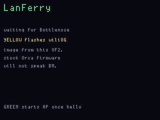
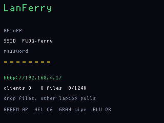
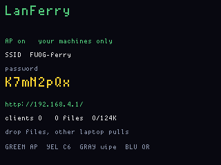
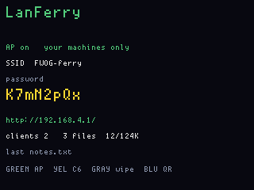
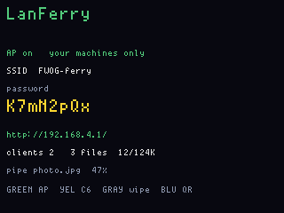
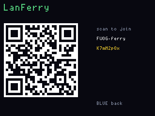
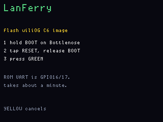
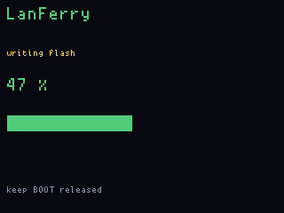
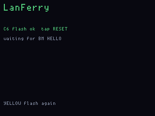

# LanFerry

**Status:** firmware in `apps/lanferry/` (VERSION **006**). Last: 2026-09-22.
**Fit:** add-on (Bottlenose).

A short-lived Wi-Fi bubble so two machines that already belong to you can
pass files without sharing an Apple/Windows ecosystem, a guest network, or
the internet.

## What to flash

1. OG — `lanferry_main`. Do not UF2-flash `lanferry_display`.
2. Bottlenose — **006 needs a C6 rewrite** (124 KiB mailbox, paste board,
   multicast pipe). **Yellow hold** on the wait or live screen
   programs it from this UF2 (hold **BOOT**, tap **RESET**, release BOOT,
   Green). Unplug the Orca USB-C first. Or flash over the C6 USB-C with
   ESP-IDF.

Until `BN HELLO` comes back, the panel stays on "waiting for Bottlenose".
Stock Bottlenose firmware will not speak this protocol.

Green starts and stops the AP. SSID is `FWOG-ferry`, WPA2 password is
generated on the C6, stored in C6 NVS (`fwog`/`ferry`), and shown on the
panel (Blue for a WIFI QR). Stop/start and a C6 reboot reuse that password.
A Yellow-hold C6 rewrite keeps NVS unless the partition is erased.
The C6 beacons **11b/g/n HT20**, not 11ax — a WIFI QR can still save the name
without a scan, so forget a leftover `FWOG-ferry` after a C6 rewrite.
`http://192.168.4.1/` is the drop — type that in the browser after joining
`FWOG-ferry`. Any peer can PUT files into a **124 KiB RAM mailbox**
(many names; a repeat name replaces; oversize PUTs are refused). Click a
name to pull it. Pastes go to a scrolling **board**, not the mailbox. Live
**pipe** fans one POST out to every peer that clicked receive; the file
may be larger than the mailbox and is not stored. The panel shows percent
while it runs.
**Gray hold** (~700 ms) mints a new password (saved to NVS), deauths
everyone, and empties the pool and board. Red hold ships the board and the AP dies with the power.

## Screens

ogemu chrome (`fw emu lanferry --gui`, or the headless
`tools/ogemu/scripts/lanferry_shots.jsonl`). Synthetic `lf_status`, no C6,
no Wi-Fi. The 6×8 font is the same as the board.

| Waiting for Bottlenose | AP off |
|---|---|
|  |  |

| AP on | Mailbox (3 files, 12/124K) |
|---|---|
|  |  |

Live pipe percent:

Blue — WIFI QR (`WIFI:T:WPA;S:FWOG-ferry;P:…;;`):

Yellow-hold C6 flash:

| Hold BOOT | Writing | OK |
|---|---|---|
|  |  |  |

## Mailbox vs pipe

| Mode | What happens |
|---|---|
| **Mailbox** | PUT `/put/<name>` stores in a 124 KiB RAM pool. Click the name (GET `/files/<name>`). Oversize files are refused. Sender can leave. |
| **Board** | POST `/board` is a scrolling note list. Not stored as a mailbox file. |
| **Pipe** | Every receiver clicks receive (POST `/pipe/arm`, then GET `/pipe/c/<id>`). Sender POST `/stream/<name>` once; C6 fans JSON chunks to all of them and keeps nothing. The file may be larger than the mailbox. |

`/` lists files as download links, a paste board, the pipe, and associated
peer IPs. SoftAP allows four stations. Live send shows byte progress on
the page and `pipe name  N%` on the OG.

## Why not station

Joining a LAN you already have is a weaker story than creating one when
there isn't one. This app does not STA.

## What it is not

It is not a rogue AP for capturing other people's traffic, not a Wi-Fi
deauther, and not a way to join a network you are not allowed on. Files
move between operators who typed the SSID from the OG's screen or scanned
the QR.
