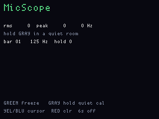
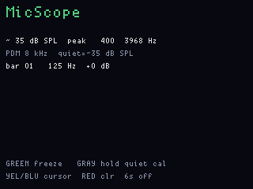
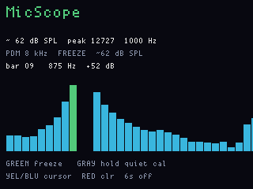

# MicScope

**Status:** firmware in `apps/micscope/` (VERSION **004**). Last: 2026-09-23.

PDM microphone spectrogram / VU on the LCD. Clap detector, tone
detector, "how loud is this room." Saving speech as files is
[TalkClip](talkclip.md), not this page.

Flash **`micscope_main`**. Do not UF2-flash the display half.

**Gray hold** (≥700 ms) in a quiet room captures RMS + per-bar floor,
saves `mscope.cal` on main FatFs (survives app flashes), and switches
the bars to a **dB SPL approximation**: quiet is treated as **35 dB SPL**,
bar height is dB above that floor (full scale = 60 dB ≈ 95 dB SPL). It
is not a calibrated meter and not A-weighted.

**Green** freeze/unfreeze (peak-hold stays). **Yellow / Blue** move the
bar cursor. **Red tap** clears peak-hold and freeze, not the cal.
**Red hold 6 s** still exits.

## Screens

Idle, waiting for a quiet cal:

After Gray-hold in a quiet inject (~35 dB SPL):

1 kHz tone, bars as dB above that floor:

Frozen:

## Host

`fw emu micscope --gui`, or the headless smokes
`tools/ogemu/scripts/micscope.jsonl` (RMS) and `micscope_tone.jsonl`
(1 kHz sine). Shots: `micscope_shots.jsonl`. ogemu has no FatFs: a Gray
hold still switches to dB for that process, but does not persist. The
harness `mic_rms` stimulus is a Nyquist square wave, so RMS/peak are
proven and the spectrogram is not — see [ogemu-beta.md](ogemu-beta.md).
`mic_tone` is a real sine.

Display PIO already budgets PDM next to WS2812 and I2S. Keep IR on the
other PIO block.

USB product strings: `FWOG display micscope 004` and
`FWOG main micscope 004`.
