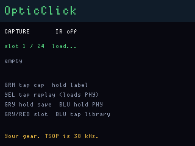

# OpticClick

**Status:** firmware in `apps/opticclick/` (VERSION **002**). Last: 2026-09-25.

Infrared **capture and replay** on the OG front-panel IR port. **NEC**, **Sony
SIRC** (12/15/20-bit), and **Philips RC5** are all in the image. Pick the PHY
from a menu; a stored slot remembers which PHY it needs and loads it on
replay. The on-device **library** is still published **NEC** TV codes. Use it
only on **equipment you own**.

## What this repo is (and is not)

**BSP** (`bsp/` in this monorepo) is the board-support package: C drivers for
the FreeWili OG’s two RP2040 CPUs (display + main). **OpticClick** is an
**app** in `apps/opticclick/` that calls those drivers. It is **not** the IR
driver itself.

The IR engine lives in `bsp/display_cpu/ir/ir_comm.c` (header:
`bsp/display_cpu/ir/ir_comm.h`). OpticClick uses **`ir_comm_init()`**,
**`ir_comm_set_phy()`**, **`ir_comm_send()`**, and **`ir_comm_read()`** on the
display CPU:

| Role | Pin | Hardware |
|---|---|---|
| TX | GPIO 9 (`PIN_IR_TX`) | PIO carrier burst → MOSFET IR LED blaster |
| RX | GPIO 16 (`PIN_IR_RX`) | TSOP75238 38 kHz demodulator |

PIO for IR uses **`pio1`**. WS2812 status LEDs use **pio0**. The **main** CPU
only runs `fwog_display_update_run()` and kicks the watchdog so the display
image (with metadata) loads over the inter-CPU link — it does not touch IR.

## PHY: one loaded at a time

**PHY** means the on-air encoding. All of these ship in the firmware; only
one is armed in pio1:

| PHY | Carrier (TX) | How it is sent |
|---|---|---|
| **NEC** | 38.222 kHz | Proven three-SM PIO (burst + control + receive) |
| **SIRC12 / 15 / 20** | 40 kHz | Same burst SM, CPU-gated marks (2.4 ms header) |
| **RC5** | 36 kHz | Same burst SM, CPU-gated Manchester halves |

**Blue hold** opens the PHY picker. Green loads it. Capture stamps the
current PHY onto the slot. **Yellow replay** calls `ir_comm_set_phy` with
that stored value, then sends the word.

The TSOP is still a **38 kHz demodulator**. 36/40 kHz TX is in-band enough
to try; SIRC/RC5 **RX is a measurement** on the demodulated pin with the NEC
receive SM parked. Treat those captures as hex to confirm, not a product
claim.

The **library** (`oc_codes.c`) stays **32-bit NEC**. Blast and library send
force NEC regardless of the menu.

Captured NEC frames with an invalid command complement are dropped
(`ir_nec_command_valid()`). SIRC/RC5 captures skip that filter.

### RX honesty

Receive on this port was **never a product claim**. The legacy reference’s
software RX path could not decode a full frame; this BSP fixes NEC buffer
shape and host-tests encode/decode math, but **board proof is still “try it
and look at the hex.”**

## Flash (main only)

Build and flash the **main** half. The main UF2 embeds the display app and
writes display metadata correctly. **Never** UF2-flash `opticclick_display`
alone — see [AGENTS.md](../../AGENTS.md) (“Do NOT `fw flash` a display
APPLICATION”).

```text
python tools/fw.py build opticclick_main
python tools/fw.py flash opticclick_main
```

USB product strings look like `FWOG display opticclick 002` and
`FWOG main opticclick 002` once VERSION is bumped.

## Operator flow

**Blue tap** switches **CAPTURE** ↔ **LIBRARY**. **Blue hold ~750 ms** opens
the **PHY** menu. **Red hold 6 s** is still the power-off / ship countdown
(WS2812 bar). Red **cannot power the board on**.

### PHY — what is loaded

Gray/Red cycle **NEC / SIRC12 / SIRC15 / SIRC20 / RC5**. **Green tap** loads
that PHY (retunes the carrier SM). **Blue tap** cancels. Capture and library
headlines show the live PHY name.

### CAPTURE — learn remotes you own

1. Pick a slot with **Gray tap** (previous) / **Red tap** (next). **24 slots**.
2. **Green tap** — arm listen. **Green tap** again cancels.
3. Point **your** remote at the OG and press the button you want to store.
4. A frame fills the slot (NEC still drops bad complements) and the
   **label** screen opens. Hex + PHY are written to **`OPTIC.BIN`**.
5. **Yellow tap** — load that slot’s PHY and replay. **Green hold** on a
   filled slot reopens labels. **Gray hold** (~750 ms) pushes slots to main
   FatFs immediately.

**Persistence:** slots live on **main-CPU FatFs** (`OPTIC.BIN`, magic `OCC1`),
the last 8 MB volume DiskGlass mounts. Each 32-byte record holds code, have,
**phy**, brand, func. An older 8-slot `OPTIC.BIN` still loads; the next save
writes 24. Display has no FatFs; main loads/saves and ships 24 records over
the link (776-byte frame, under the 4160-byte payload cap).

**T9 labels:** first pick **function** (Gray/Red: POWER, MUTE, CH+, CH−, VOL+,
VOL−; Green tap continues; Blue cancels). Then type **brand**: Gray/Red cycle
ABC…WXYZ groups, Yellow/Blue pick the letter, Green tap inserts, Yellow hold
backspaces, Green hold saves the label.

### LIBRARY — published NEC codes

`apps/opticclick/oc_codes.c` — well-known NEC wire words, **not** a LIRC dump.
Zeros are skipped when blasting. Send/blast always load **NEC**.

**Yellow tap** cycles function. **Gray/Red** cycle brand (Samsung, LG, Vizio,
Hisense, TCL, Insignia, Roku, SharpNEC, Toshiba).

| Control | Action |
|---|---|
| **Green tap** | Send current brand + function as NEC (skip if unknown) |
| **Yellow tap** | Next function (POWER → MUTE → CH+ → …) |
| **Yellow hold ~750 ms** | Blast **that function** across every brand with a non-zero word (~280 ms gap) |

**Owned TVs only.** Not a hallway tool.

### Quick reference

| Page | Green | Yellow | Gray / Red | Blue |
|---|---|---|---|---|
| **CAPTURE** | Tap: arm/cancel. Hold: label | Replay (loads slot PHY) | Tap: slot. Gray hold: save now | Tap: library. Hold: PHY menu |
| **LIBRARY** | Send brand+fn (NEC) | Tap: next fn. Hold: blast | Brand | Tap: capture. Hold: PHY menu |
| **PHY** | Load selected | — | Cycle PHY | Tap: cancel |
| **Label / T9** | Tap: next / insert. Hold: done | Tap: letter. Hold: backspace | Function or T9 group | Cancel / letter |

LCD footer: **IR ok** / **IR FAIL**. Headline shows live PHY. Bottom line:
your gear; TSOP is 38 kHz.

## Screens

ogemu panel chrome (IR PIO is stubbed; capture idle, IR off):



## Host emulator

`fw emu opticclick` is not the primary workflow for IR (ogemu does not model
the TSOP receiver or blaster). Use **hardware** for capture and blast checks.

## Related source

| Path | Purpose |
|---|---|
| `apps/opticclick/display/main.c` | UI, PHY menu, capture/replay, T9, library blast |
| `apps/opticclick/oc_codes.c` | Library NEC words by brand × function |
| `apps/opticclick/oc_proto.h` | Link frames + `OPTIC.BIN` layout (`phy` per slot) |
| `apps/opticclick/main/main.c` | Display bring-up, watchdog, FatFs persist |
| `bsp/display_cpu/ir/ir_comm.c` | NEC PIO + SIRC/RC5 encode and gated TX |
