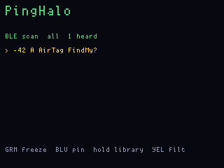

# PingHalo

**Status:** v023 firmware. **Fit:** add-on (Bottlenose ESP32-C6 on the desk).
Last touched: 2026-09-27. **v023** waits 3 s after splash+uart_init before
`LIB_GET` (same CTS/watchdog splash loop as ChirpMail 005). BLE scan
**verified on hardware** after the ROM-pin C6 rewrite. v016 pinned a tagged
advertiser with burst RSSI bars. **v018** stored the Blue pin into an empty
library slot. **v019** shows **SAVING**. **v020** writes `PHLIB.TMP` then
renames to `PHLIB.BIN`. **v021** freezes the MAC list (no live reshuffle),
**Yellow deletes** a library slot. **v022** commits a T9 name as a 20-byte
`LABEL` (not the whole library), stops BLE and drains UART for 500 ms, then
writes FatFs.

The library is a **BLE address book**, not a recording of the radio. Each
slot keeps the 6-byte MAC, an optional T9 name, and nothing else — no
RSSI history, no ADV payload, no “signal.” Later Green-on-slot hunts
that same public address if it advertises again. Find My identities can
rotate; a saved MAC may go quiet. A reboot during/after save is OK if
the file finished — 020 is that finish.

The library is a **BLE address book**, not a recording of the radio. Each
slot keeps the 6-byte MAC, an optional T9 name, and nothing else — no
RSSI history, no ADV payload, no “signal.” Later Green-on-slot hunts
that same public address if it advertises again. Find My identities can
rotate; a saved MAC may go quiet. A reboot during/after save is OK if
the file finished — 020 is that finish.

Proximity finder for BLE advertisers, including Apple Find My / AirTag-style
beacons (public advertisement, rotating identity). Presence only.

## Hardware

Stock OG has **no Bluetooth radio**. Display and main USB are CDC device,
the radios are CC1101 sub-GHz. AirTags do not speak 315/433 MHz.

A **Bottlenose** Orca supplies it: ESP32-C6, 2.4 GHz Wi-Fi + Bluetooth, on
the 20-pin header. UART1 at **115200** 8N1 **without** CTS/RTS, powered from
the OG. Bottlenose USB-C is **debug only** — USB Serial/JTAG will show
`fwog-bn: ready` and never `BN HELLO` (HELLO is header UART only). Unplug
USB-C for UART ROM download; the C6 ROM prefers USB Serial/JTAG when that
cable is in.

## What to flash

Flash **`pinghalo_main`** only. Do not UF2-flash `pinghalo_display`. The
main UF2 embeds the display image and the merged C6 image
(`firmware/bottlenose/fwog_c6.bin`).

**v009 changed the app UART from 3 Mbaud to 115200.** The C6 still running
the 007/008 image will not speak this baud. After flashing `pinghalo_main`,
you **must rewrite Bottlenose** over the header:

1. **Yellow** on the OG (HOLD). LCD shows live `8=` / `9=` edge counts.
2. **Unplug Orca USB-C.** Keep the OG powered.
3. **Hold BOOT** on the Orca and **keep it held**.
4. **Tap RESET** on the Orca (still holding BOOT).
5. **Green** on the OG **while BOOT is still held**. ~1 minute write.
6. Writer **stays in the C6 ROM** (`FLASH_END` execute=False) so a reboot
   with BOOT still down does not re-enter download. **Let go of BOOT**,
   then tap Orca **RESET**. USB-C `ESP-ROM:esp32c6-…` alone means the
   chip is still in the loader — you want the next line
   `SPI_FAST_FLASH_BOOT`, then `fwog-bn: ready`. `DOWNLOAD` means BOOT
   is still held. LCD `rxb=` is UART bytes; main CDC `[pinghalo] BN HELLO`.
   If USB-C was plugged during Green, rewrite once with it unplugged.

`8=` / `9=` on the waiting screen are live pad edges with **both** UART
FPGA dirs as inputs. v012 showed `8=` climbing and `9=0` with no UART
bytes — C6 app TX (GPIO17) is on **OG GPIO8**, while uart1 RX is GPIO9
(that pin carries ROM U0TXD / C6 GPIO16). v013 receives HELLO with the
ROM SWAP PIO (RX GPIO8) at 115200. `rx=42 4E` is `BN`. USB `fwog-bn: ready`
is not the OG link.

v014 auto-starts BLE scan after `BN HELLO`. GPIO9 SWAP TX (FPGA out +
bitbang) ran on this Orca (`fully=1`) but never reached C6 RX — the chip
kept its 1 s HELLO retry and scan stayed off. The C6 image now uses ROM
pins (TX GPIO16 / RX GPIO17) so OG uart1 APP (TX GPIO8 / RX GPIO9) can
send `BN BLE START`. After rewriting Bottlenose with that image, scan
lists BLE advertisers. A board still on the old TX17/RX16 app image
needs that rewrite once (Yellow / BOOT / RESET / Green, then let go of
BOOT and tap RESET).

v011 applies the ROM-APP FPGA dirs (TX out, RX/CTS/RTS in — no default
RTS output that fights the shifter) and stops driving GPIO11.

v006 died at `SPI_ATTACH`. v007 wrote the image. v008 dropped CTS/RTS; USB
proved the C6 app runs (`fwog-bn: ready`) but HELLO still never arrived —
3 Mbaud through the FPGA/shifter was never proven; ROM only worked at
115200 on the same GPIO9. v009 is that 115200 app UART on both sides.
v010 drops the GPIO IRQ that counted `rx9=` (it undersamples 115200 and
does not prove UART bytes), stays quiet until HELLO so a 3 Mbaud leftover
image can retry, and spells out “let go of BOOT then RESET”.
v011 matches header FPGA dirs to the ROM APP pass (no RTS output) and
showed a 40 ms `e9=` sample that could miss a 1 ms HELLO. v012 listens
both UART pins every loop (`8=` / `9=`) and binds splash `012`.
v013 PIO-receives on GPIO8 (SWAP) after 012 proved that pin carries app TX.

Scan starts by itself once Bottlenose has said hello. **Green tap**
**freezes** the current MAC list (up to 16) so Gray/Red can **scroll**,
Blue can **pin**, and you can save to the library without the rows
swapping. RSSI on those rows stays as snapshotted. Green tap again
returns to live scan (**FROZEN** / `N locked` on the status line).
**Green hold** (~750 ms) **starts or stops** a Bottlenose
flash (same as Yellow hold to start; hold Green again to cancel). On the
BOOT-hold screen, Green **tap** still begins the write.

Gray/red move the cursor; **Blue tap** tags the highlighted row and pins
it to the top. The pin stays on row 0. **Blue hold** opens the **LIBRARY**
(FatFs `PHLIB.BIN` on main). On an **empty** slot, **Green** writes the
currently pinned (or cursor) MAC into that slot. The panel shows
**SAVING LIBRARY** (solid yellow LEDs) while main stops BLE, then
erases/programs FatFs. It stores the **BLE address and optional name**, not
RSSI. When it returns you should see the name/MAC, not `empty`. On a
**filled** slot, **Green** hunts that MAC; **Yellow tap deletes** that
entry. Blue tap leaves the library.

**Gray hold** on a highlighted row opens a **T9** keyboard. The name you
type is shown in brackets (scale 2). **grp** (letter group) and **char**
(the letter Green will insert) are **scale 4**. Gray/Red change group,
Yellow/Blue change char, Green tap inserts, Yellow hold backspaces, Green
hold saves that **one MAC + label** (not a full-library rewrite). The
panel stays on **SAVING LIBRARY** until the FatFs commit returns.

A 24-burst RSSI bar chart is the hunt instrument: each bar is the RSSI of
one `BN ADV` for that MAC, oldest on the left. **Green** means that burst
was at least 5 dB stronger than the previous one (walking toward), **blue**
is inside the deadband, **red** is weaker (walking away). The first bar is
blue. Silence between AirTag Find My bursts is not scored. LEDs follow the
latest bar colour. Blue tap again unpins. Yellow tap cycles **all / named /
Apple**. `A` / `FindMy?` means manufacturer ID `0x004C`. Hold yellow to
flash the C6 image.

Until `BN HELLO` comes back, the panel stays on "waiting for Bottlenose".

## Screens

ogemu panel chrome (Bottlenose is a stub main, not a C6):

Waiting, then a synthetic Apple ADV:

## What it will not do

It will not decrypt Apple's payload or show a named "keys in a backpack"
record without Apple's ecosystem. Anti-stalking "unknown tracker" style
presence is the honest product.
