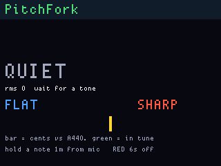
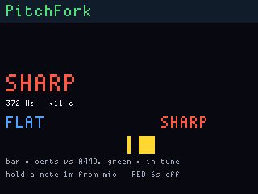

# PitchFork

**Status:** firmware in `apps/pitchfork/` (VERSION **003**). Last: 2026-09-26.

Chromatic tuner on the display PDM mic. **A4 = 440 Hz**. Flash **`pitchfork_main`**
only (never the display UF2). Hold a tone about a metre from the grill.
**G4** locked on 002 hardware.

The **note name is huge** (scale-6 glyphs — the LCD driver now allows that;
older images silently drew nothing above scale 3). Under it, **FLAT**,
**IN TUNE**, or **SHARP** spells what the green/yellow bar is doing.

**Gray tap** cycles a locked MIDI note **E2–E5**. **Gray hold** (~700 ms)
returns **AUTO**. **Red is only ship** (6 s hold) — it does not change the
note. In AUTO the name must agree for **three frames** before it sticks;
cents are a 2/3 EMA so the bar does not chatter. With a lock, the name stays
put and only the cents bar (and LEDs) move versus that note. RMS floor
is **100**.

## What you are looking at

| On screen | Meaning |
|---|---|
| **F#4** (scale-6 glyphs) | Nearest equal-temperament note |
| **IN TUNE** (green) | Within ±8 cents of that note |
| **FLAT** (blue) | Below the note |
| **SHARP** (red) | Above the note |
| **QUIET** | RMS under the floor — no pitch lock. LEDs stay dim. |
| **Yellow tick** at bar centre | 0 cents (in tune) |
| **Green block** on the bar | How far you are from in-tune (~2 px per cent). Left = flat, right = sharp. Same story as the WS2812: centre LED green when close, left blue, right red. |

The bar is **not** a volume meter. Volume is the `rms` / “wait for a tone”
line. The bar is **cents vs the shown note** (A440 temperament).

**Red hold 6 s** still powers the board off.

## Why an F# might not lock

The mic path is the MP34DT06J → PIO PDM → CIC → **8 kHz PCM**. That is
enough for guitar-range notes. It is not a measurement microphone.

1. **Too quiet.** Phone speakers and muted guitar at arm’s length can sit
   under the RMS floor (**100**). The LCD says **QUIET**, not a wrong note.
   Get closer or louder. 001 used 200 and missed a lot of bench tones.
2. **Too low.** FFT bins start at ~94 Hz (DC leakage is thrown away) and
   the DC blocker sits around 127 Hz. Bass **F#2 (~93 Hz)** and low E will
   not lock. Use F#3 (~185 Hz) and up.
3. **Too high.** Usable map is **80–3500 Hz**. F#7 (~2960 Hz) can lock;
   F#8 (~5920 Hz) is past Nyquist (4 kHz) and will not. A phone app on a
   high octave is the usual miss.
4. **Bin width.** One PDM buffer is 256 samples, so each FFT bin is
   **31.25 Hz**. 002 interpolates the peak and folds via a harmonic-product
   spectrum (plus a 2nd–4th subharmonic check) so a guitar’s 2nd harmonic
   is less likely to steal the name. A buzzy square wave can still land on
   the wrong octave.
5. **CIC droop.** Response falls toward Nyquist (~12 dB). A thin 3 kHz
   tone is weaker than a 400 Hz one at the same speaker volume.

MicScope remains the spectrogram if you need to *see* whether energy is
even there.

## Screens

ogemu panel chrome (PDM inject, not the board):

Quiet, no pitch lock:



370 Hz injected → **F#4**:



## Flash

```text
python tools/fw.py build pitchfork_main
python tools/fw.py flash pitchfork_main
```
