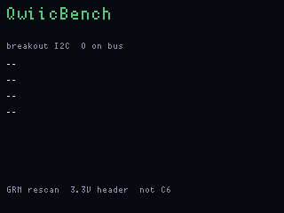
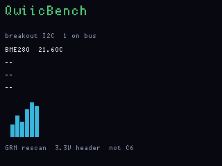
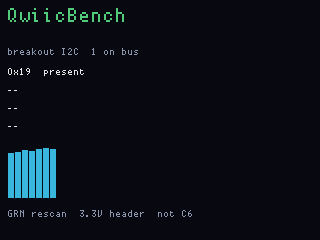

# QwiicBench

**Caveat: real I2C sensor modules have not been tested.** v001 was
flashed on hardware; empty-bus chrome is what that pass covered. Named
BME280/BH1750 reads and the sparkline from live silicon are unverified.

**Status:** v002 firmware (T9 nicknames on unknown addresses). **Fit:**
native (breakout I2C). Last: 2026-09-26.

I2C sensor bench on the 3.3 V header. HeaderKit finds addresses; this
reads them. BME280 (0x76/0x77, chip id 0x60) shows temperature. BH1750
(0x23/0x5C) is named. Anything else is listed as present. **Gray hold**
on an unknown row opens the same T9 keyboard as PingHalo so you can
nickname that address; names live in a RAM table keyed by address (no
FatFs on this app — gone on reboot). BME280/BH1750 stay chip-named. A
sparkline plots the first channel. Unrelated breakout buses stay Hi-Z,
same policy as HeaderKit.

## Screens

ogemu panel chrome (not a physical I2C bus):

Empty header:

Named BME280 and sparkline:

Unknown address listed as present:

## Easy tests (no extra silicon required for the first two)

1. **Panel chrome without a board.** `fw emu qwiicbench` (or `--gui`).
   The smoke injects a fake BME280 so you can see the name line and
   sparkline. That does not talk to real I2C. Gray-hold T9 on an injected
   `0x19 present` row is the nickname path.
2. **Empty-bus hardware.** Flash **`qwiicbench_main`** only. With nothing
   on the header you should get `breakout I2C  0 on bus` and Green
   rescan. That proves main I2C + pull-ups without a module.
3. **Any 3.3 V I2C part.** SDA/SCL/3V3/GND on the OG side header (not
   Bottlenose Qwiic). Green rescan. An unknown address shows as
   `0xNN  present`. Gray/Red move the cursor; Gray hold T9-names it
   (Green tap inserts, Green hold saves to RAM).
4. **Named sensors.** SparkFun/Adafruit BME280 at 0x76 or 0x77 for
   temperature; BH1750 at 0x23 or 0x5C for a named light sensor (lux not
   decoded yet). HeaderKit 004 first if you want the address list before
   this dashboard.

Qwiic on the Bottlenose Orca is a different bus than the OG breakout —
this app talks to the main-CPU header. 3.3 V only.

Host CTest `test_qg_sense` names BH1750 / generic present without I2C,
and `qg_nick` set/get on a RAM address key.
