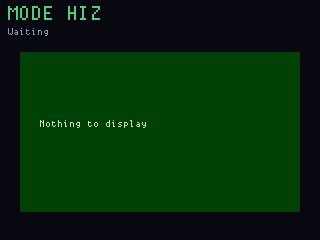

# Retia (Bus Pirate)

**Status:** firmware in `apps/retia/` (VERSION **005**).
**Fit:** native, main RP2040 breakout I/O.

Retia is the OG's Bus Pirate-style USB CDC terminal. It starts in high
impedance mode and provides GPIO, I2C, UART and SPI modes on the labelled
3.3 V breakout pins. The LCD shows the active mode, pinout and status.

It is strictly a **3.3 V** tool; the breakout is not 5 V tolerant.

**App Explorer:** flash with `fw flash retia_main` (never UF2-copy
`retia_display`). v001 sat at the CDC prompt without kicking the watchdog,
so the main CPU reset every 8.3 s and 1200-baud BOOTSEL from Explorer could
not stick. v002 kicks while waiting for a line. v003 printed the real
`io_dir` failure and retried. v004 brings the link up **after** splash.
v005 re-inits display I2C/expander after the splash WAV so `mode uart`
gets a real PCAL6416 write (004 NACKed `IO_CONFIG` with the link up).

Build and flash `retia_main`, then attach to the **main** CPU console
(`fw console` without `--cpu main` often opens the display):

```text
python tools/fw.py build retia_main
python tools/fw.py flash retia_main
python tools/fw.py console --cpu main
```

(`--cpu` is a `console` flag, not a global one. `--port COM5` also works
if you already know the main CDC.)

Enter `help` for mode-specific commands. `mode i2c` (or `m 3`) opens
I2C. If a change fails, the line names the step: display not acking
`IO_CONFIG` means the display half is still in splash or not Retia;
FPGA readback mismatch is gateware/SPI.

Use `mode hiz` before rewiring a target.

## Screens

ogemu panel chrome (HiZ until the CDC half sends a mode frame):


