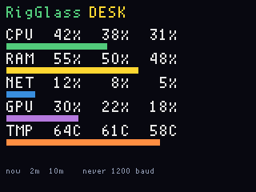

# RigGlass

**Status:** v002 firmware. **Fit:** native. Last: 2026-09-26.

Host CPU, RAM, network, GPU, and CPU temperature as LCD rows (instant,
2-minute average, 10-minute average) plus a bar for the instant value.
The helper on **this** PC writes lines to the **main** CDC:

```
RG cpu=12:10:8 ram=45:44:40 net=8:5:3 gpu=30:20:15 tmp=61:58:55 host=desk
```

Each triple is `now:2min:10min`. Network is percent of the busiest
adapter's link speed (same idea as Task Manager), not a placeholder.
GPU and temperature show `--` when Windows will not expose them (255 in
the line).

```
python tools/rigglass/rigglass.py
```

Flash **`rigglass_main` 002**, then run the helper. Never open that port
at 1200 baud.

Title is `RigGlass` with the computer name on the same row to the right.
Labels are scale 2.

## Screens

ogemu panel chrome (host gauges injected, not `rigglass.py`):


