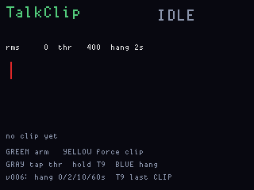

# TalkClip

**Status:** firmware in `apps/talkclip/` (VERSION **006**). Last: 2026-09-26.

v004 writes 8 kHz clips to main FatFs as `/talkclip/CLIPNNNN.RAW` for
[DiskGlass](diskglass.md). **v005** keeps writing PCM while the room is
below the threshold for a hangover (default **2 s**). **Blue hold**
cycles hang **0 / 2 / 10 / 60** seconds. Hang 0 closes on the first quiet
block. **v006** adds **Gray hold** T9 to rename that last CLIP to an
8.3-safe `NAME.RAW` (A–Z, eight characters). **Gray tap** still moves
the threshold — the hold does not steal the tap. REC is still visible.
Display CDC keeps start/stop/rename lines; the file is the product.

A voice-activated note recorder on the display microphone. **VAD is the
product**, not an extra: it listens for speech-level energy, keeps a short
hangover after the room goes quiet, and writes 8 kHz clips to main’s
flash. It is a field notebook with an automatic start, not a hidden bug.

Stock FreeWili firmware already recorded the same microphone to WAV from
the serial menu and showed a “quiet threshold” LED in the sensors app.
TalkClip is that idea as a front-panel app, with the threshold doing the
start/stop instead of a key on a terminal.

## Hardware

The mic is an MP34DT06J PDM capsule on the display CPU (clock on GPIO 17,
data on GPIO 29). The BSP already captures it at **8000 samples per
second**. That is telephone-ish speech, not music, and it matches the
speaker’s sample rate so a clip can be played back on the same board.

Display owns the mic, the screen, and the buttons. Main owns the only
disk (`fwog_fs`, 8 MB of FatFs). Audio has to cross the inter-CPU link
while a clip is open. At 8 kHz 16-bit mono that is 16 KB per second,
which is comfortable on the existing UART. One open file at a time is a
FatFs rule on this BSP, so a clip is opened, appended, closed — not two
WAVs at once.

## Voice activation, in ordinary terms

Every block of samples has a loudness. Below a threshold, we are in
silence. Above it, we open a clip (or keep writing the one we have).
When loudness stays down, we **keep recording** until the hangover
expires (Blue hold: 0, 2, 10, or 60 seconds), then we close the file.
That hangover is what keeps “um” and a breath from chopping a sentence
into ten files. The quiet tail is in the WAV, not just a delayed close.

The threshold should be settable (Gray tap / Red) and visible as a line on a
tiny VU meter, because a room’s noise floor is not a datasheet constant.
v002 applies 8× digital gain after the CIC and starts the threshold at
400 so a conversation at desk distance opens a clip; clap-level 1200 was
too high. Green arms and disarms the detector. Yellow forces a clip open
or closed regardless of loudness, for when you want a continuous take.

**Gray hold** (~750 ms) opens the same five-button T9 as PingHalo / OpticClick
(`lcd/fwog_t9.h`) and names the last closed `/talkclip/CLIPNNNN.RAW`. A clip
that is still open is closed first. No last CLIP → hold is ignored (tap still
lowers the threshold). Names are **A–Z, max eight**; main writes
`/talkclip/NAME.RAW` with `fwog_fs_rename`. Empty names do not send. If the
target already exists, the rename fails and the CLIP name stays.

| In T9 | Tap | Hold (~750 ms) |
|---|---|---|
| **Green** | insert current letter | commit `NAME.RAW` |
| **Yellow** | previous letter in group | backspace |
| **Blue** | next letter in group | (no hang cycle) |
| **Gray** | previous group | cancel T9 |
| **Red** | next group | 6 s ship still |

The LED bar and a **REC** badge on the LCD stay on for the whole open
file. Ship-mode and a dark screen must not hide that. A recorder that
looks like it is off is a different product, and not this one.

## Why a USB stick does not solve the disk

See [stickpeek.md](stickpeek.md): the OG cannot host a flash drive on
the stock USB connector. Uncompressed speech fills the 8 MB volume in
roughly **eight minutes** of solid talking (about a megabyte per minute
at 16-bit/8 kHz). Voice activation is doing real work here: a day of
carrying the board only writes while someone is actually speaking.

Longer sessions need either pulling files to the PC over CDC as you go
(the same dump story as [InertialTrail](inertialtrail.md)), or a
**microSD on main’s breakout SPI** — see
[docs/hardware/microsd.md](../../hardware/microsd.md). Do not hang the
card’s chip-select on header pin 1 (that pin is the FPGA’s). Original
FreeWili firmware already treated SD as FatFs drive `1:`; this BSP
dropped that volume because the OG has no socket.

## Screens

ogemu panel chrome (PDM path stubbed; no FatFs):

## What it is not

It is not a wiretap kit. Recording other people without consent is
illegal in many places (some US states require every party to agree).
The firmware should make recording obvious: REC on the glass, the LED
bar live, no “stealth” skin. Clips are yours to pull over USB to the
PC you plugged into. `python tools/fsbak/fsbak.py` is **supposed** to
write a sibling `.wav` next to each dumped `/talkclip/*.RAW` (8 kHz
mono). **Not verified yet** — hang until the helper is checked. DiskGlass
plays the `.RAW` on the OG speaker.

It is not a 44.1 kHz studio deck. Nyquist is 4 kHz. It will sound like
a phone. That is enough for a spoken note and not enough to pretend
otherwise.

MicScope stays the spectrogram. TalkClip is the thing that keeps the
WAV.
