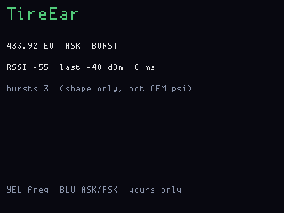

# TireEar

**Status:** firmware in `apps/tireear/` (VERSION **004**). Last: 2026-09-27.

TPMS-shaped listen on the main CC1101. Display is the front panel; main
does demod, a small OEM profile table, and a RAM scan log.

Yellow / Blue set the radio. Green runs a parking-lot window. Gray / Red
only mean something in REVIEW. Blue **hold** (~700 ms) cycles the decode
profile. Red **hold 6 s** still ships the board off (`FWOG_POWER_DEFAULT`).

## Radio

| Yellow tap | 315 NA ↔ 433 EU (and the matching 200 / 400 MHz antenna pair) |
| Blue tap | ASK ↔ 2-FSK |
| Blue hold | OEM profile: AUTO, PMV-107J, Toyota, Schrader |

Main captures GDO0 edges, packs LSB-first, and tries the selected profile.
A matching CRC paints ID, psi, and °C. A miss still keeps a short **raw**
hex dump for offline review. There is no one generic TPMS frame; psi is
only shown when that profile’s CRC passes.

## Modes

**listen** — live RSSI, last burst length, decode or “pending”.

**SCAN** — Green tap from listen starts a **45 s** window (`TE_SCAN_MS`).
Distinct IDs (or raw captures) go into a 32-slot log in **main RAM**
(not FatFs). Green tap during SCAN stops early and opens REVIEW. The
timer ending does the same.

**REVIEW** — Gray up / Red down walk the log. Green tap returns to listen.
Green hold from listen or SCAN also jumps to REVIEW (empty if you never
scanned).

## Buttons (LCD footer)

Two lines, 42 columns — the old single line was 49 characters stuffed into
44 columns and clipped.

| | listen | SCAN | REVIEW |
|---|---|---|---|
| **YEL** | 315 / 433 | same | same |
| **BLU tap** | ASK / 2-FSK | same | same |
| **BLU hold** | next OEM profile | same | same |
| **GRN tap** | start 45 s scan | stop, open REVIEW | back to listen |
| **GRN hold** | REVIEW | REVIEW | REVIEW |
| **GRY / RED** | (no-op unless a log exists) | (no-op) | up / down the list |

Footer text:

- always: `YEL 315/433     BLU ASK/FSK`
- listen: `GRN scan  hold REVIEW  BLUhold OEM`
- SCAN: `GRN stop+list  hold REVIEW  BLUhold OEM`
- REVIEW: `GRY up  RED down  GRN listen`

## Hardware

Main: CC1101 radio 0, watchdog kick. Display: LCD, five buttons, antenna
mux over the expander link. Boot splash is the NES-box DEF CON seal.

## Screens

ogemu panel chrome (listen):

