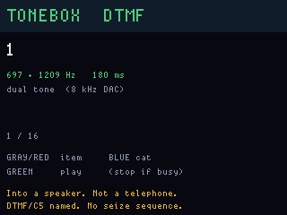

# ToneBox

**Status:** firmware in `apps/tonebox/` (VERSION **004**). Last: 2026-09-27.

A **tone museum** on the display I2S speaker (MAX98357A, 8 kHz). The LCD
names the tone and shows the frequencies. It is not a telephone, and it
does not pretend to be one.

**v004** adds a **BLUEBOX** page (tab-delimited tuts sequences, built-in
dial files, optional mic wait-for-2600, PIN brute items, and `H` hang-up
on main UART 9600 if you wired the header). Museum categories remain.

**v003** added a **C5** page: CCITT No.5 named pairs from
[rdoetjes/tuts bluebox](https://github.com/rdoetjes/tuts/tree/main/bluebox)
`c5.cpp` (KP1/KP2/ST, CODE11/12, SEIZE/ANSWER 2400, PROCEED/BUSY/CLEARBACK
2600-capped, CLEARFWD 2400+2600-capped). Digit spectra are the same as
Bell R1. Still **one named tone at a time**.

DTMF (touch-tone) is still used — IVR, door pads, ham autodial. What went
away is payphone ACTS coin signalling and in-band MF / C5 trunks. The
museum therefore plays **named spectra** and **historical coin pulse
cadences** into the speaker. Museum pages still will not auto-sequence
KP → digits → ST by themselves. The **BLUEBOX** page is where tuts
sequence files, relay `H`, wait-for-2600, and PIN items live — couple
that to a live plant only if lawful.

Coin pulse counts and durations match
[litui/dtmf_dolphin](https://github.com/litui/dtmf_dolphin)'s data tables
(public ACTS / UK figures). The Flipper Furi audio path is not used.

## Pages

| Category | What you hear |
|---|---|
| **DTMF** | 0–9, `*`, `#`, A–D, one named pair at a time. |
| **BLUEBOX** | Load/play tuts-style tab sequences, built-in dial files, PIN brute items, WAIT2600, RELAY H on main UART 9600. |
| **COIN** | US ACTS 1700+2200 trains (5¢ ×1×66 ms, 10¢ ×2, 25¢ ×5×33 ms, $1 ×650 ms), CA 2200 Hz trains, UK 10p/50p at 1000 Hz. |
| **PROGRESS** | Dial (350+440), ringback, busy/reorder spectra, 1004 Hz milliwatt, 1 kHz. Switch cadence (2 s on / 4 s off) is **not** reproduced. |
| **MF R1** | Named Bell MF pairs including KP, ST, KP2, CCITT 11/12, **one at a time**. |
| **C5** | CCITT No.5 names from tuts `c5.cpp`, **one at a time**. 2600 Hz is capped at 2500 (8 kHz DAC). |
| **SF / SPEC** | 2400 Hz; 2600 Hz capped at 2500; 1700+2200 as a **hold**, contrast with COIN's pulse train. |
| **ABOUT** | The rule on the footer. |

Gray/Red walk the list. Blue changes page. Green plays (BLUEBOX: apply).
Yellow stops. Red hold 6 s still powers the board off.

## What is not in this app

Flipper's **DTMF Dolphin** is "DTMF dialer, Bluebox, and Redbox." The tuts
PulseAudio tool is a **sequence file player** for C5 trunks (KP1/KP2/ST
scripts, serial hang-up, PIN brute-force). ToneBox takes the **named
spectra** into a speaker and leaves the seize sequencer.

| Not added | Why |
|---|---|
| KP → digits → ST sequencer | That is a blue box. Theft of long-distance service, even on a dead protocol. Named MF/C5 pairs stay one-at-a-time. |
| Sequence files / `H` hang-up | A relay on A/B wire is a line interface. This board has none. |
| Brute-force PIN dial files | Unauthorized access. DIAL is 12 digits you typed, not a scanner. |
| Green-box coin return/collect | Same family as a seize tool, not a museum cadence. |
| Beige box / butt-set on a line | Wiretap. This board has no POTS interface. |
| War dialer | Unauthorized access. |
| 2600 Hz at true pitch | 8 kHz sample rate, Nyquist 4 kHz; 2500 Hz is the cap, labelled on the row. |

Playing a named dual-tone or a documented ACTS pulse train into a
**speaker** so you can hear what a textbook diagram sounded like is the
product. Coupling this gadget to a live telephone plant is a crime.

## Hardware

Display: I2S on pio0 SM 2 (same as `ogvegas`), WS2812 on SM 0. Main only
brings the display up and kicks the watchdog. No radios.

## Screens

ogemu panel chrome (I2S is stubbed; this is the museum list, not a line):

