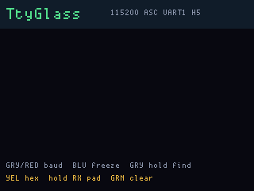

# TtyGlass

**Status:** firmware in `apps/ttyglass/` (VERSION **004**). Last: 2026-09-26.

A UART terminal on the LCD so a gadget console can sit on the OG. **v004**
picks **one RX pad from a four-entry header allowlist** — not a 20-pin
dump, and not “any GPIO.” DEF CON boot, GOODBYE / sign off on 6 s red.

## Pin allowlist — header, if it can carry UART

A breakout adapter can land on more than UART1. The LCD only names the
**current RX job**: `UART1 H5`, `GP26 H14`, `GP27 H3`, `CTS H7`. Yellow
**hold** cycles that list. SPI (FPGA) and I2C (open-drain) are not on it.

| Tag | Header | GPIO | How |
|---|---|---|---|
| UART1 | 5 | GP9 | silicon UART1 RX (GP8 TX idle) |
| GP26 | 14 | GP26 | PIO 8N1 listen |
| GP27 | 3 | GP27 | PIO |
| CTS | 7 | GP10 | PIO on the UART1 CTS pad |

Not offered: UART0 (inter-CPU link), GP25 (main LED), GP12–15 (FPGA SPI),
SDA/SCL. Those are not “appropriate” for a 3.3 V console adapter.

**Yellow hold** to change RX. One status line. HeaderKit still owns the
physical map if you forget which hole is 14.

## Buttons

| | Live | Frozen | T9 find |
|---|---|---|---|
| **Blue tap** | freeze | follow tail | next letter |
| **Gray tap** | previous baud | page older | previous group |
| **Red tap** | next baud | page newer | next group |
| **Gray hold ~750 ms** | T9 search | T9 search | cancel |
| **Yellow tap** | HEX / ASCII | HEX / ASCII | previous letter |
| **Yellow hold** | next RX pad | next RX pad | backspace |
| **Green tap** | clear ring | clear | insert |
| **Green hold** | — | — | find (empty = cancel) |

## Screens

ogemu panel chrome (header UART is a stub; empty scrollback):

## What it is not

Not a TX console. Not FatFs capture. Not Bottlenose.
