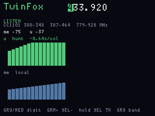
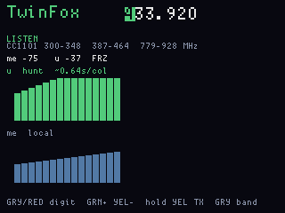

# TwinFox

**Status:** firmware in `apps/twinfox/` (VERSION **005**). Last: 2026-09-26.

Fox-hunt / range toy on the two onboard CC1101s. Both ears sit on **one**
carrier you set (default 433.920 MHz). Walk toward a known ASK source —
another OG, a fob, or this board’s Yellow-hold beacon.

## Sample rate

Main posts RSSI every **80 ms**. The graphs do **not** plot that tick.
Each column is the **mean of 8 ticks** (~**640 ms**). 36 columns is about
**23 s** of walk. Blue freeze stops the average so a peak stays on
screen; the live dBm line still updates.

Beacon TX (when armed) is still one `FWOG`+seq packet every **400 ms**
on radio 0, then that chip returns to RX.

## Frequency

Gray/Red move the cursor across six digits (`433.920` is kHz). Green
adds one, Yellow tap subtracts one. **Gray hold** parks ISM centres
**315.000 / 433.920 / 915.000** and switches the 200/400/900 MHz
antenna path.

The CC1101 only tunes three bands. The LCD prints them:

`300–348`  `387–464`  `779–928` MHz

Everything else is a **GAP** (348–387 and 464–779). The radio will not
follow a gap. 915 MHz is in the high band; 433.92 is mid; 315 is low.

## How it transmits

Listen is the default. Yellow **hold** (~700 ms) toggles a beacon on
**radio 0 only**: ASK/OOK, ~10 dBm, same frequency as the hunt.
Amateur / ISM rules still apply.

## Why both chips on the same frequency

Two ears, one fox. Live line is **me** (RSSI0, local, bottom) and **u**
(RSSI1, hunt, top + LEDs). Split bands would be two hunts.

## What the columns are

Each bar is **time**, not frequency: left is older, right is newer,
about **0.64 s** per column (mean of eight 80 ms RSSI ticks). Taller is
stronger (dBm mapped up from about −110). The two traces are the two
CC1101s on the **same** carrier:

| Colour | Label | Radio | Meaning |
|---|---|---|---|
| **Green** | **u** hunt | RSSI1 | The fox ear. Walk so these bars grow. The LED bar follows this ear. |
| **Slate blue** | **me** local | RSSI0 | This board’s ear (and the beacon radio when Yellow-hold TX is on). |

They are not two channels and not a waterfall of bands. Green vs blue
only answers “which chip.” Inverse **green on a frequency digit** is the
cursor, not RSSI.

Blue freeze holds the columns; the live `me` / `u` dBm line still
updates.

## Buttons

| | |
|---|---|
| **Gray / Red tap** | previous / next frequency digit |
| **Green tap** | +1 that digit |
| **Yellow tap** | −1 that digit |
| **Yellow hold** | beacon on/off |
| **Gray hold** | next park 315 / 433.92 / 915 |
| **Blue tap** | freeze / follow graphs |
| **Red hold 6 s** | ship |

## Screens

ogemu (injected RSSI, not a walk): green **u** hunt on top, slate **me**
local below. Freeze holds the history.

