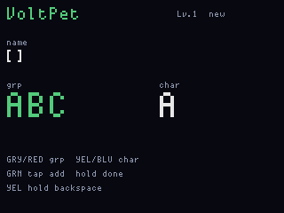

# VoltPet

**Status:** firmware in `apps/voltpet/` (VERSION **005**). Last: 2026-09-26.

A cheerful Electric-type companion from the Isle of Ring -- part sunshine
in the cheeks, part blue-gold blur when it runs. Train, nap, play-fight,
and snack. Relics ride in on quiet radio bursts. **Gray hold** opens a T9
keyboard so you can name it; the name is the same FatFs `voltpet.bin` as
the stats.

A new save rolls one of five looks -- SUNCHEEK, GOLDLOOP, BOLTQUILL,
MEADOW, RINGSPARK -- and that spark stays until it goes home. **Yellow
hold (~1.4 s)** on the meadow lets this one go and hatches another.
Play-fights never kill it. Only long neglect (hungry, exhausted, and
unhappy for several minutes of ticks) sends it back to the isle, then a
new spark chooses you.

v005 still saves `voltpet.bin` on main's FatFs when red is armed for ship
(and on Green-hold from T9, and on hatch). A missing volume stays a RAM
pet and says so. A v002 36-byte file still loads (stats kept, name empty,
species rolled); the next write is 48 bytes. Older v001 saves are a new
pet. v003 files with `_pad` 0 stay SUNCHEEK.

## Who it is

VoltPets store sunshine in their cheeks and sprint in happy loops. A
VoltPet chooses you when it hears a kind frequency -- a laugh, a song, or
a stray beacon. The tone is Pokemon-pleasant: nobody gets hurt for real,
play-fights end in naps, and treasures have stories.

## What to do

Yellow / Blue pick an activity, Green starts it, Gray tap opens relics,
**Gray hold (~750 ms)** names the companion, **Yellow hold (~1.4 s)**
retires this spark and rolls a new one. Short Red backs out of an
activity (not T9). A 6 s red hold still saves, then ships.

T9 matches PingHalo: Gray/Red cycle ABC…WXYZ groups, Yellow/Blue pick the
letter, Green tap inserts, Yellow hold backspaces, Green hold saves the
name into `voltpet.bin` (up to 11 letters). Empty is allowed (title stays
the species name). The headline shows the T9 name once it is set.

Train mash and fight Spark / Dash / Cheer flash the WS2812 bar and a
brief meadow burst so the tap is visible. Sprite erase uses a padded
dirty rect so bob/run/Zzz do not leave trails.

| Activity | What happens |
|---|---|
| **Train** | Five-second montage. Mash Green or shake the board. XP. LED flash on each mash. |
| **Sleep** | Energy returns in the shade. Green wakes. |
| **Fight** | Eight wild friends, **unlocked by spark level** (`2 + level/2` of the roster, capped at 8): Dust Bunny and Static Fluff first, up through Cloud Ram. HP/ATK also scale with level. **Yellow Dash** runs at the foe; they lunge/jab/puff back. Spark (Green) and Cheer (Blue) animate, then the foe answers. Wins and sleepy losses add XP. Sleepy losses do not end the pet. |
| **Eat** | Not a button snack. Shake (kinetic berry), sing (song-snack), or catch a radio burst (sparkfruit). |
| **Relics** | Browse finds. One hundred Heroes-of-Might-and-Magic-style named artifacts, each with a slot, a tiny bonus, and a backstory. |
| **Story** | Isle of Ring origin. |

The sprite wanders the meadow, blinks, bobs, and changes pose for run,
nap, snack, and spark. Wild friends can appear while you idle if energy
is up.

## Radio relics

Main parks a CC1101 on 315 / 433.92 / 868 MHz and hops every 2.5 s. A
rising RSSI edge rolls one of the 100 relics, with a 12 s cooldown so the
bag does not fill from one noisy burst. Duplicates are a familiar spark;
new ones go in the bag. The table lives in `vp_art.c` and is host-tested
for unique ASCII names.

## Why battery is still the game mechanic

Red held 6 s calls `fwog_ship_enter()` and the pack FET opens. A gray hold
or USB wakes the hardware with the CPUs fully reset. RAM is gone. If the
pet lived only in SRAM, every ship is a death.

`fwog_power_poll()` sets `armed` the moment the 6 s countdown starts.
That is a six-second save window. On `armed` rising, display tells main
to flush FatFs. Periodic checkpoints cover a yank of USB or a crash.

The BQ25896 on the display CPU reports pack voltage. A hungry pet is a
low cell -- same as v001.

## Where state lives

| Store | Who | Survives ship? |
|---|---|---|
| Main FatFs `voltpet.bin` | main CPU | Yes. Canonical save (stats + T9 name + species). |
| MCP7940 SRAM / RTC | display | Maybe, if the coin-cell backup is fitted and VBATEN is on. Unused in v005. |
| Display RAM | display | No. |

Main owns the filesystem and the radios. Display owns the charger ADC,
buttons, LIS3DH, PDM mic, and the sprite. The pet is still a two-CPU save
protocol; the relic roll is a 12-byte RF event on the same link.

Flash `voltpet_main`. Do not UF2-flash `voltpet_display`.

## Screens

ogemu panel chrome (sprite + T9 path; relics from a stub RF frame):

## What it is not

It does not change the ship-mode contract. Red still powers the board
off. The pet saves *because* of that, not by blocking it. It does not
decode other people's radio traffic -- RSSI is the whole find.
